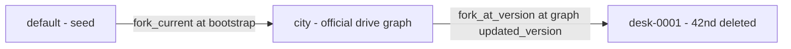

# strata-island: a Manhattan drive-graph on Strata

Follow-up: [Named places and graph workloads](graph-expansion-plan.md) covers the proposed expansion, graph stress workloads, and engine findings. This document preserves the original V1 design.

| Field | Value |
|---|---|
| **Date** | 2026-09-18 |
| **Status** | Accepted draft |
| **Working title** | `strata-island` |
| **Home** | `/data2/GitHub/strata-apps/strata-island` — a self-contained app in [strata-apps](https://github.com/stratalab/strata-apps), not a path-dep crate next to `strata-core` |
| **Depends on** | published `stratadb` (`git = "https://github.com/stratalab/strata-core", tag = "v1.2.3"`). A checkout builds with nothing else present. Local engine work uses an untracked `.cargo/config.toml` `[patch]`, never a path dep in `Cargo.toml` |
| **Bind** | `127.0.0.1:7450`, durable `./island-db` |
| **Audience** | Engineers shipping an app on StrataDB; the engine is a dependency, not a sibling checkout |

The talk line this demo exists to make true:

> I closed 42nd Street. The official city still routes through it. I compared the two paths.

Destination product (later rungs, mostly after engine gaps close): type two addresses, get a drivable path. V1 ships rungs 1–4 only.

---

## Overview

**strata-island** is a standalone StrataDB app: a local Manhattan-island drive map. You pan the island, click two intersections (or pick two named places), and get a directed shortest path in integer meters. You fork the official city onto a construction desk, delete 42nd Street between 5th and 8th, and compare. The official city still routes through 42nd. The desk goes around.

It lives in `strata-apps` next to colonies, as its own folder, its own `Cargo.toml`, its own database directory. It is **not** a path-dep crate of `strata-core`, **not** a gitignored local stress harness, and **not** a mode of colonies / ksp / pit. A clean checkout of `strata-apps` plus `cargo run` in this folder is enough. The engine comes from the published `v1.2.3` tag.

Delivery: local axum binary, one vanilla canvas, durable `./island-db`, `include_str!` of `static/{index.html,style.css,app.js}`. No React, no MapLibre, no tileserver, no live OSM. No `Cargo.lock` in git (strata-apps convention). Local engine work: untracked `.cargo/config.toml` patch, never edit the `stratadb` line.

**2-week, 6-PR** project at 1.0 FTE against the `strata-apps` repo. Each PR leaves a runnable app one step richer. Engine gaps go to GitHub issues on `stratalab/strata-core` via `Log::hit` + `docs/friction.md`. Do not patch the engine from this app. Do not open `pit-db.fat` / `pit-db.longrun-*` (#3319) — those dirs are not this app's data.

Do not claim "legal Manhattan drive." V1 is shortest path on a directed node/edge graph.

---

## Background & Motivation

### What other Strata apps already hit (and why this is still a new app)

| Demo | Graph | Hero | Unused here |
|---|---|---|---|
| Colonies | Decorative `lineage` on `default` | Twenty live branches, three sequential capability writes per tick | Petri dishes, `--stress-cells` |
| KSP | Stick of parts, tens of nodes, `GraphBatchWrite` | Long event tape, `fork_at_version`, `promote(design, vab)` | Kinematics, promote beat |
| Pit | Unused on the hot path | Many-key `put_batch`, 200 Hz matcher off the db mutex, fork-at spike | Tape firehose, 30 Hz `/api/state` |

Handle model as of 1.2.x (`crates/engine/src/api/database.rs`): `kv` / `json` / `event` / `graph` are `&self`; `branches()` and `vector()` are still `&mut self`. `GraphService` mutating methods (`bulk_insert`, `adjacency_index`, `delete_edge`, `list_nodes`, `neighbors`, `create_graph`) still take `&mut self` on the service.

Pit talk is true on a **fresh** `./pit-db` only. Durable reopen of a firehose db OOM-killed the process at ~48 GiB RSS (#3319). Island stays frozen after one import so that landmine does not fire.

### What the island must hit

| Surface | Why |
|---|---|
| `GraphService::bulk_insert` of a real street graph | ~4k–8k drive nodes, ~10k–15k directed edges, chunked ≤ 800 (default 512) |
| `adjacency_index` as a RAM snapshot | Camera and Dijkstra run on it. `list_nodes` is id-prefix, **not bbox** |
| Demo Dijkstra-with-predecessors | Engine `sssp` returns `GraphSsspResult { source, distances }` — **no path** |
| `fork_at_version` + `delete_edge` of a named corridor | Child index rebuilt; parent snapshot untouched |
| `compare` of graph entities | Graph `supports_promotion() == false` (#3177). Compare is the landing |
| Integer meters | Engine weight is `f64`. Demo routing is `u32`. No `f64` in `geo.rs` / `route.rs` |

Copying another app's persist shape blindly fails the talk:

1. KSP `batch_write` of a handful of upserts would hide `bulk_insert`.
2. Pit's 30 Hz `/api/state` would either no-op or take the db. The island does not move except on construction.
3. Calling engine `sssp` for a polyline is a lie (`analytics.rs` 81–110).
4. Calling `promote(desk, city, …)` would carry JSON/KV, **not** the deleted edges (#3177).
5. Live Overpass makes the golden move. Vendored extract, like pit's RING/SPIKE seed.

---

## Goals & Non-Goals

### Goals

1. Talkable local Manhattan-island drive map at `http://127.0.0.1:7450`.
2. Exercise for real: `bulk_insert` of a city, `adjacency_index` RAM snapshot, demo Dijkstra (engine `sssp` is distance-only), `fork_at_version` + `delete_edge` without rebuilding the parent, `compare` of graph entities.
3. Closed geo/routing spec: one island, integer meters, one named closure, one gazetteer table, demo Dijkstra. Specified below — not "we'll figure it out."
4. Survey Plat UI: vanilla canvas, axum, REST. No MapLibre, no tiles, no TypeScript SDK.
5. Tests: integer geo, Dijkstra on an 8×8, persist cache + durable tempfile resume (city **and** desks), Manhattan golden, `clippy -D warnings`.
6. Honest findings strip. The map is the hero.
7. Mast numbers: node/edge counts, `persist-ms` of last import/close, live cap 4.

### Non-goals

- Not Kerbal, not Petri dishes, not a CLOB, not a shared catalog or database with other `strata-apps`.
- Not a production router: no turn bans, no no-left, no U-turn expansion, no traffic, no CH/CCH.
- **Not NYC-legal driving.** Engine graph is node/edge, not `(node, incoming-edge)`.
- Not the metro. **One island.** No Brooklyn, no Queens, no airports. FDR Drive and West Side Highway stay. Bridges are stubs or omitted.
- Not walk, service alleys, buildings, footways, or live Overpass.
- Not typed street-number addresses in V1 (rung 5, later).
- **No `promote` in V1.** Compare is the landing.
- No tileserver, MapLibre, raster tiles, WebGL, 30 Hz `/api/state`, WebSocket, or 200 Hz matcher.
- No live `strata` CLI against `./island-db` while we hold the lock (#3128).
- Do not patch `strata-core` from this app. Do not depend on a local `strata-core` checkout in `Cargo.toml`. Road Rash is deferred.

---

## Destination ladder

V1 ships **rungs 1–4 only**.

| Rung | User-facing | Where | Blocker |
|---|---|---|---|
| 1 | Map of the island, pan/zoom | Demo RAM snapshot | None |
| 2 | Click two intersections → path | Dijkstra on drive graph | None |
| 3 | Close 42nd on a desk, compare | Fork + two indexes | No promote (#3177) |
| 4 | Type/pick two **named places** | JSON gazetteer | None (frozen table) |
| 5 | Type two **addresses** | House-number interpolation | Demo-side later |
| 6 | Path is **legally drivable** | Turn bans | Node/edge graph, not `(node, incoming-edge)` |
| 7 | Closure **lands** on the official city | Promote | #3177 |
| 8 | Pin on the map, not a node | Nearest / bbox API | No spatial index. 5k linear scan is fine here, not a product API |
| 9 | City grows past one island | CH/CCH | `sssp` is Dijkstra. 5k is the point |
| 10 | Reopen after a long session | Durable recovery | #3319. Frozen city only |

---

## Proposed Design

### Repo layout

```
/data2/GitHub/strata-apps/strata-island/
  Cargo.toml
  README.md
  docs/implementation-plan.md    # this document
  docs/friction.md
  tools/extract.md               # regeneration notes; not a cargo dep
  src/main.rs
  src/lib.rs
  src/geo.rs                     # integer meters, snap, AABB; no f64
  src/route.rs                   # Dijkstra-with-predecessors; no f64
  src/extract.rs                 # parse vendored JSON
  src/store.rs                   # stratadb adapter
  src/world.rs                   # import, fork, close, route, compare, resume
  src/snapshot.rs                # wire contract
  src/findings.rs
  static/{index.html,style.css,app.js}
  fixtures/grid-8x8.json
  fixtures/manhattan-drive.json  # PR2
  fixtures/closure-42nd.json
  fixtures/gazetteer.json
  tests/{geo,route,persist,golden}.rs
```

This folder is tracked in the `strata-apps` git repo (like `strata-colonies`). It is **not** listed in the root `.gitignore` next to `/strata-ksp/` and `/strata-pit/` — those two are unpublished local harnesses. Island is a standalone app.

```toml
[package]
name = "strata-island"
version = "0.1.0"
edition = "2021"
rust-version = "1.91"
license = "Apache-2.0"
publish = false
description = "A Manhattan drive-graph on Strata — close 42nd, the official city still routes through it"

[lib]
name = "strata_island"
path = "src/lib.rs"

[[bin]]
name = "island"
path = "src/main.rs"

[dependencies]
# Published engine tag. A checkout of this folder builds with nothing
# else on disk. For a local strata-core working tree, add a [patch] in
# an untracked .cargo/config.toml — do not edit this line.
stratadb = { git = "https://github.com/stratalab/strata-core", tag = "v1.2.3" }
axum = { version = "0.8" }
clap = { version = "4.5", features = ["derive"] }
serde = { version = "1", features = ["derive"] }
serde_json = "1"
tokio = { version = "1", features = ["full"] }

[dev-dependencies]
tempfile = "3"
```

Binary `island`, bind `127.0.0.1:7450`, db `./island-db`. `--cache` for tests. No `ws` feature. No `Cargo.lock` committed (strata-apps convention). If `store.rs` exceeds ~500 LOC, split in the same PR that tips it.

Example untracked patch (never committed):

```toml
# strata-island/.cargo/config.toml
[patch."https://github.com/stratalab/strata-core"]
stratadb = { path = "/path/to/strata-core/crates/stratadb" }
```

### Architecture

```mermaid
flowchart TB
  subgraph ui [Browser - vanilla canvas]
    plat[Survey plat]
    gold[Gold official route]
    crimson[Crimson desk overlay]
    mast[Mast: city/desk, n/e counts, persist-ms]
    transport[Click-to-route / Close 42nd / Compare / Archive]
  end

  subgraph bin [island binary]
    axum[axum REST]
    world[World]
    ram[RAM DriveIndex per live branch]
    dijkstra[route.rs integer Dijkstra]
    dbm[Mutex of Database]
    store[store.rs]
  end

  subgraph strata [stratadb]
    graph[GraphService - manhattan / street]
    json[JsonService - gazetteer + meta]
    event[EventService - one closed per desk]
    br[BranchService - fork_at_version / compare / delete]
  end

  plat --> axum
  transport --> axum
  axum --> world
  world --> ram
  world --> dijkstra
  axum -->|"import / fork / close / compare / audit spawn_blocking"| dbm
  dbm --> store
  store --> graph
  store --> json
  store --> event
  store --> br
  ram -.->|"never graph()"| graph
```

Camera and Dijkstra **never** call `graph()` / `kv()` / `json()` / `event()` / `branches()`. HTTP that must touch the db `spawn_blocking`s and takes `Mutex<Database>`. Never hold that mutex across `.await`.

```mermaid
sequenceDiagram
  participant UI as Canvas
  participant Axum
  participant World
  participant RAM as DriveIndex
  participant DB as Mutex Database

  UI->>Axum: GET /api/city
  Axum->>World: snapshot (no db)
  RAM-->>UI: whole island DTO
  Note over UI: pan/zoom is local

  UI->>Axum: POST /api/route
  Axum->>World: snap + Dijkstra
  RAM-->>UI: integer polyline

  UI->>Axum: POST /api/close
  Axum->>World: spawn_blocking
  World->>DB: graph_info.updated_version
  Note over DB: drop GraphService
  DB->>DB: fork_at_version(city, desk-NNNN, cv)
  Note over DB: drop BranchService
  DB->>DB: delete_edge each frozen triple on child
  DB->>DB: adjacency_index(child) + list_nodes
  Note over DB: drop mutex
  World->>RAM: insert child; parent untouched
```

### Frozen names

| Thing | Value |
|---|---|
| Product space | `city` — `ProductSpace::new("city")` once. No `spaces().create` |
| Graph | `manhattan` |
| Edge type | `street` — one type. One-way vs two-way = one vs two directed edges |
| Official branch | `city` (forked from `default` at bootstrap) |
| Seed branch | `default` — hidden, undeletable |
| Desks | `desk-0001` … monotonic, never reused. Counter `city` JSON `meta.next_desk` |
| Live cap | **4** = `city` + ≤ 3 `desk-*`. Fifth → `failed_precondition.island.desk_cap` |
| Node id | `n:{osm_node_id}` (PR2) or `n:g{col}_{row}` (PR1 grid) |
| City version | `CITY_VERSION = 1` frozen in PR6 |
| Analytics budget | `GraphAnalyticsBudget::new(20_000, 80_000)` |
| Import node cap | **20_000**. Expected 4k–8k nodes / 10k–15k directed edges |
| Bulk chunk | `None` → engine default 512, max 800 |

```rust
pub const SPACE: &str = "city";
pub const GRAPH_MANHATTAN: &str = "manhattan";
pub const EDGE_STREET: &str = "street";
pub const DOC_META: &str = "meta";
pub const DOC_CITY: &str = "city";
pub const BRANCH_DEFAULT: &str = "default";
pub const BRANCH_CITY: &str = "city";
pub const CITY_VERSION: u32 = 1;
pub const NODE_CAP: usize = 20_000;
pub const ANALYTICS_NODES: usize = 20_000;
pub const ANALYTICS_EDGES: usize = 80_000;
pub const LIVE_CAP: usize = 4;
```

`OpenArgs.memory_budget_bytes` forwarded like pit. Do not spin-retry `resource_exhausted.engine.persistence_budget`.

### Strata adapter rules (`store.rs`)

Load-bearing. Module-level comment, same shape as pit/ksp.

1. `World` holds `Mutex<Database>`. Import, fork, close, compare, audit take it. Those HTTP paths `spawn_blocking`. Never hold db across `.await`. Camera and Dijkstra never call capability APIs.
2. `json` / `event` / `graph` are `&self` on `Database` and **may be held together**. `branches()` is `&mut self` and exclusive with every other handle. `GraphService` mutations still `&mut self`. Close sequence: `graph_info` → drop GraphService → `fork_at_version` (branches) → drop BranchService → `delete_edge` loop → `adjacency_index` + `list_nodes` → drop mutex → route in RAM.
3. No public cross-capability `CommitPlan`. Crash between `bulk_insert` chunks is real. **Resume rebuilds from graph rows for every live branch** (see **Open / resume**). JSON is not the city.
4. Weights: finite `f64` of integer meters. Demo routing uses `u32`. Import refuses `fract() != 0.0` or `< 1.0`. Store the same integer as property `length_m` (JSON integer, not `81.0`).
5. `fork_at_version` from `GraphService::graph_info(&manhattan)?.updated_version()`. Gazetteer JSON is written **before** `bulk_insert` so the child inherits it. Child name `desk-{n:04}`. Do not `fork_current` as a silent fallback. `POST /api/close` `from` must be `city`; anything else → `invalid_argument.island.branch`. Desks are direct children of `city` only.
6. Never delete `city` in the V1 UI. Archive `desk-*` first (#3196). Refuse `default`.
7. `promote` is not called.
8. Space `city`, graph `manhattan`, edge `street`.
9. No IPC (#3128). Do not tell the UI to shell out to `strata`.
10. Gazetteer bindings: `GraphBindingPrimitive::Json`, **omit `branch`** (`None`) so a fork does not trip `unsupported.engine.graph_binding_cross_branch`. Denormalized `node` field on the JSON doc is the demo lookup.
11. One event `closed` per desk (integers and strings only). Canonicalize serialize→parse before `EventPayload::new` (#3188). No tape. No `batch_append` (#3179).
12. Memory budget like pit when `--memory-mb` is set.

`kv()` unused. Write stress is graph `bulk_insert`, then a handful of `delete_edge`.

```rust
fn event_payload(value: Value) -> Result<EventPayload, stratadb::EngineError> {
    let bytes = serde_json::to_vec(&value).expect("event payload encodes");
    let canonical: Value = serde_json::from_slice(&bytes).expect("event payload JSON roundtrips");
    EventPayload::new(canonical)
}
```

### Integer local meters (`geo.rs`)

No `f64` in `geo.rs` or `route.rs`. A grep test enforces it.

| Quantity | Value |
|---|---|
| Origin lat | **40.7003** (The Battery) |
| Origin lon | **−74.0170** |
| Bbox | south 40.70, north 40.88, west −74.03, east −73.91 |
| Projection | equirectangular at origin latitude, **extract-time only** |

Extract-time (documented in `tools/extract.md`; **not** called from `geo.rs`):

```text
x = round( (lon - ORIGIN_LON) * 111_320.0 * cos(ORIGIN_LAT * π/180) )
y = round( (lat - ORIGIN_LAT) * 110_540.0 )
```

Runtime AABB (`geo.rs` constants), origin/bbox + 500 m pad, rounded outward to 100 m:

```text
AABB_X_MIN = -1600
AABB_X_MAX =  9600
AABB_Y_MIN =  -600
AABB_Y_MAX = 20400
```

| Op | Rule |
|---|---|
| Nearest node | `min (dx*dx + dy*dy)` as `i64` over the RAM list |
| Snap radius | **80 m** (`SNAP_R2 = 6400`). Farther → `invalid_argument.island.snap` |
| Corridor / POI snap | **40 m** extract-time only |
| Path length | saturating sum of `u32` meters |

`list_nodes` is id-prefix pagination (`service.rs` 671–749), **not bbox**. Do not query Strata for the camera.

Property encode/decode (import and resume): write `x` / `y` / `length_m` as JSON integers. Read with `as_i64()` / `as_u64()`. Refuse `f64` even when `fract()==0`. That keeps `geo.rs` / `route.rs` grep-clean and resume deterministic (`json!({"x": 1234})` is `i64`; a round-trip that emits `1234.0` is `Kind::Bug`).

### Extract format

Vendored JSON. Runtime never hits OSM. Footer: **© OpenStreetMap contributors**.

```json
{
  "attribution": "© OpenStreetMap contributors",
  "osm_date": "2026-09-01",
  "generated": "2026-09-18",
  "bbox": {"south": 40.70, "north": 40.88, "west": -74.03, "east": -73.91},
  "origin": {"lat": 40.7003, "lon": -74.0170},
  "nodes": [{"id": "n:42436566", "x": 1234, "y": 5678}],
  "edges": [{"src": "n:…", "dst": "n:…", "length_m": 81, "name": "West 42nd Street"}]
}
```

Runtime `extract.rs` refuses before any `bulk_insert`:

- Duplicate node ids, dangling endpoints, empty graph, `src == dst`.
- `x`/`y`/`length_m` that are not JSON integers.
- `length_m == 0`; node outside `AABB_*`; node count > `NODE_CAP`.
- Duplicate `(src, dst)` after parse (the generator already merged; a committed file that still has them is `invalid_argument.island.extract`).

`oneway` is an extract-time OSM tag, not a runtime field. The committed JSON is already directed.

PR1 ships `fixtures/grid-8x8.json`. PR2 commits `fixtures/manhattan-drive.json`. The 8×8 stays as the `tests/route.rs` fixture.

Python osmnx is **not** a runtime or CI dependency. Regeneration is `tools/extract.md`. PR2 **records** counts and hash from a file this recipe produced. Do not change the recipe to make the golden band pass.

#### OSM generation recipe (frozen)

Pinned source: Geofabrik `new-york` PBF dated **2026-09-01**, clipped to the frozen WGS84 bbox. An Overpass equivalent of the same bbox + highway filter is acceptable if that day's PBF is gone. **The filters below do not move.**

**Highway allow-list:** `motorway`, `motorway_link`, `trunk`, `trunk_link`, `primary`, `primary_link`, `secondary`, `secondary_link`, `tertiary`, `tertiary_link`, `unclassified`, `residential`, `living_street`.

**Drop even if named:** `service`, `footway`, `path`, `pedestrian`, `cycleway`, `steps`, `bridleway`, `track`, `construction`, `proposed`, `corridor`, `platform`, `raceway`, `busway`, `bus_guideway`, `emergency_bay`, `abandoned`, `disused`, `rest_area`, `services`, `escape`. Drop if `area=yes`. Drop the way if **any** node is outside the frozen WGS84 bbox (this is how bridges leave the island; FDR and the West Side Highway stay).

**Oneway mapping** (per OSM way, before collapse):

| Tag | Directed segments |
|---|---|
| `oneway=yes` / `true` / `1` | Keep node order |
| `oneway=-1` / `reverse` | Reverse node order |
| `oneway=no` / `false` / `0` / absent | Both directions |
| `junction=roundabout` or `junction=circular` (even if oneway absent) | Implied oneway in way direction |

**Intersection collapse** (keeping every polyline vertex will blow `NODE_CAP`):

1. Build the directed segment graph from allow-listed ways (consecutive OSM nodes, `length_m = max(1, round(segment meters))`).
2. Undirected degree of each OSM node.
3. **Keep** a node if any of: undirected degree ≠ 2; it is within 40 m of a gazetteer or corridor WGS84 pin (below); incident segments have different `name`.
4. Replace each degree-2 chain between kept nodes with one directed edge per direction that exists. `length_m = max(1, round(sum))`. `name` = chain name if unique, else first non-empty.
5. Self-loops refuse the extract.
6. Duplicate `(src, dst)` after collapse: **merge** — keep one edge, `length_m = min`, `name` = first non-empty.

Expected after collapse: **4_000..=8_000** nodes, **10_000..=15_000** directed edges. If this recipe lands outside that band, **record the actual counts in PR2 and freeze those**. Do not loosen the allow-list to hunt a number.

#### Corridor and gazetteer WGS84 pins (extract-time, frozen)

These numbers are **not** runtime geodesy. The generator snaps them to drive nodes (40 m) and writes node ids into `fixtures/closure-42nd.json` and `fixtures/gazetteer.json`. After PR2 those files are the golden; runtime never sees lat/lon.

| Pin | lat | lon | Role |
|---|---|---|---|
| 8th Avenue & West 42nd Street | 40.7558 | −73.9903 | West end of the closed corridor. Talk origin pin |
| 5th Avenue & West 42nd Street | 40.7540 | −73.9816 | East end of the closed corridor |
| Park Avenue & East 42nd Street | 40.7527 | −73.9772 | Talk destination pin (Grand Central) |
| The Battery | 40.7033 | −74.0170 | Camera origin POI |
| Empire State Building | 40.7484 | −73.9857 | Pickable POI |
| Bellevue Hospital | 40.7394 | −73.9756 | Pickable POI |
| Lincoln Tunnel (NY portal) | 40.7614 | −73.9980 | Pickable POI |

**Closure generation (PR2, then freeze the exact list):**

1. Snap 8th & 42nd and 5th & 42nd to kept drive nodes (`n_west`, `n_east`). Fail closed if either snap misses (`invalid_argument.island.extract` at generation time — do not ship the file).
2. Take every directed extract edge whose `name` matches `*42nd Street*` (case-insensitive, covers `West 42nd Street` / `East 42nd Street`) **and** whose both endpoints have `x` between `n_west.x` and `n_east.x` inclusive.
3. Expected count **6..=20** directed edges. 0 or > 64 fails closed.
4. Commit the exact `{src, edge_type, dst}` list. Golden asserts **set equality**, not "on the order of."

**Talk-pair binding (not nearest-to-building):**

- `poi:port-authority` **pinned** to `n_west` (8th & 42nd). The Port Authority building sits south of 42nd; naive nearest-node lands on 8th & 41st and the shortest path can miss the corridor.
- `poi:grand-central` **pinned** to the Park & 42nd snap. East of 5th, so Port Authority → Grand Central must cross the closed 5th–8th corridor (or detour around it).
- Other POIs: nearest kept node to the frozen WGS84 pin, 40 m. If a pin misses, drop that POI from the fixture rather than silently binding a random corner.

Why this pair, not Battery → Grand Central: Battery → GCT's shortest directed path is likely FDR, which uses 42nd **east of 5th**, not the closed 5th–8th corridor. Camera still opens at the Battery; the talk script pans to midtown and picks the two named places.

#### Synthetic 8×8 grid (PR1, frozen)

Two-way grid, 100 m spacing, origin `(0, 0)`.

- Nodes `n:g{col}_{row}` for `col,row in 0..=7` (64 nodes). `x = col * 100`, `y = row * 100`.
- Horizontal edges named `Street {row}`; vertical named `Avenue {col}`.
- **42nd analog — three avenue blocks, six directed edges**, Street 4 from Avenue 3 through Avenue 6:

```text
(n:g3_4, street, n:g4_4)
(n:g4_4, street, n:g5_4)
(n:g5_4, street, n:g6_4)
(n:g4_4, street, n:g3_4)
(n:g5_4, street, n:g4_4)
(n:g6_4, street, n:g5_4)
```

Closing them does not disconnect the grid; Dijkstra goes via Street 3 or Street 5.

- Talk pair: `n:g2_4` → `n:g6_4`. Parent uses at least one of the six; child uses none; child length ≥ parent; both reach.
- PR1 gazetteer: `poi:battery → n:g0_0`, `poi:port-authority → n:g3_4`, `poi:grand-central → n:g6_4`, `poi:empire → n:g5_3`, `poi:bellevue → n:g7_2`, `poi:lincoln → n:g1_4`.

### Engine graph facts (cited, not invented)

```rust
// database.rs ~390
pub fn graph(&self, branch: BranchName, space: ProductSpace) -> EngineResult<GraphService<'_>>

// service.rs
pub const DEFAULT_BULK_CHUNK_SIZE: usize = 512;
pub const MAX_BULK_CHUNK_SIZE: usize = 800;
pub fn bulk_insert(&mut self, graph, nodes, edges, chunk_size: Option<usize>) -> …
pub fn adjacency_index(&mut self, graph, budget: &GraphAnalyticsBudget) -> …
pub fn list_nodes(&mut self, …) // id-prefix, not bbox
pub fn delete_edge(&mut self, …) -> GraphDeleteOutcome // missing => deleted == false, no commit

// analytics.rs 81–84
pub struct GraphSsspResult {
    source: usize,
    distances: Vec<Option<f64>>,
}
```

`GraphAdjacencyIndex` (`adjacency.rs` 97–136): private `node_lookup: HashMap<GraphNodeId, usize>`; public `node_ids()`, `node_index()`, `outgoing()`, `incoming()`, `edge_type_name()`. Edges carry `weight: f64`. **No node properties, no edge names.** There is **no** `list_edges`.

**`GraphSsspResult` is distances only. You cannot unpack a path from engine `sssp`.** Missing source → `not_found.engine.graph_node`. Negative weight → `failed_precondition.engine.graph_negative_weight`. `GraphBfsResult` is hop-count; do not use it for driving.

`GraphEdgeData::new` rejects non-finite (`invalid_argument.engine.graph_edge_weight`). `GraphName` rejects leading `_` and `/`. `GraphEdgeType` rejects leading `_`. `GraphNodeId` allows `:`.

Graph does not promote (`adapter.rs`, every adapter). Compare reports `ComparedCapability::{GraphMetadata, GraphNode, GraphEdge, GraphOntology}` from `stratadb::branch::*`, not the crate root.

`fork_at_version(source, name, version)` — `branch/service.rs` 190–203. `create_graph` on an existing graph returns `Err` with `already_exists.engine.graph` (not Ok). Resume:

```rust
match graph.create_graph(name) {
    Ok(_) => {}
    Err(e) if e.code() == "already_exists.engine.graph" => {}
    Err(e) => return Err(e),
}
```

That code is a swallowed resume signal, not a user-facing 409.

`list_nodes` loads all node rows, sorts, then applies prefix/cursor in memory. Paging 512 at a time is ~12 full scans at 5k — fine, but file it next to "no bbox" rather than treating it as a streaming cursor.

### RAM city snapshot

```rust
pub struct DriveIndex {
    pub branch: String,
    pub node_ids: Vec<String>,         // index-aligned with adjacency
    pub xy: Vec<(i32, i32)>,
    pub outgoing: Vec<Vec<DriveEdge>>,
}

pub struct DriveEdge {
    pub dst: usize,
    pub length_m: u32,
    pub name: Option<String>,          // label only
}

pub struct World {
    db: Arc<Mutex<Database>>,
    city: Mutex<BTreeMap<String, DriveIndex>>, // "city" + desk-*
    gazetteer: Mutex<Vec<Poi>>,
    findings: Arc<Log>,
    durable: bool,
    db_path: String,
    next_desk: AtomicU64,
    last_persist_ms: AtomicU64,        // integer milliseconds
    last_compare: Mutex<Option<CompareView>>,
}
```

Build from engine, then **drop the db mutex**:

1. `adjacency_index(&manhattan, &analytics_budget())`.
2. Each `GraphAdjacencyEdge.weight` must be integer ≥ 1; store as `u32`. Else `Kind::Bug`.
3. Page `list_nodes(..., 512)` for `x,y`. Missing / non-integer is `Kind::Bug`.
4. **Street names:** join `(src, dst) → name` from the **committed extract fixture** (already hashed). `neighbors(Outgoing)` is a permitted debug/audit walk, not the open path. File "no `list_edges` / adjacency carries no properties" next to the no-bbox finding.

`GET /api/city` returns the **whole island**. Canvas owns camera. Compact wire: `s`/`d` are indexes into `nodes`; `m` is `length_m`; `n` omitted when empty. ~0.4 MB. Fine for localhost once.

### Routing (`route.rs`)

Snap: click → nearest RAM node inside `SNAP_R2`. Finding: no engine nearest-node.

Path: Dijkstra on outgoing directed edges, cost = integer meters. Heap `(Reverse(cost: u32), node_index: usize)`. Predecessors unpack the node-id list.

Tie-break: when costs equal, the stored predecessor is the **lowest predecessor index**. Heap pop order among equal costs is not the source of truth.

```text
dijkstra(index, src, dst) -> Result<Path, IslandError>:
  dist[src] = 0
  pred[src] = None
  heap.push(Reverse(0), src)
  while let Some(Reverse(cost), u) = heap.pop():
      if u == dst: break
      if cost > dist[u]: continue
      for e in index.outgoing[u]:
          cand = cost.saturating_add(e.length_m)
          better = cand < dist[e.dst]
                || (cand == dist[e.dst] && pred[e.dst].is_none_or(|p| u < p))
          if better:
              dist[e.dst] = cand
              pred[e.dst] = Some(u)
              heap.push(Reverse(cand), e.dst)
  if dist[dst] is inf: Err(unreachable)
  unpack pred → node ids + xy + length_m
```

Do **not** unpack a path from engine `sssp`. File a finding. Tests may call `index.sssp(&source, GraphDirection::Outgoing)` and assert `demo.length_m as f64` equals the engine distance rounded to nearest `u32`. Mismatch is `Kind::Bug`. Tests-only, not the click path.

Unreachable → `failed_precondition.island.unreachable`. 42nd 5th–8th will **not** disconnect Manhattan.

Golden (8×8 and Manhattan talk pair):

- Parent path uses **at least one** closed triple (`used_closed == true`).
- Child path uses **none**.
- Child `length_m >=` parent `length_m`.
- Both reach.

Latency: in-process p99 **< 20 ms** on 5k/12k.

PR1 ships `src/route.rs` as a stub: snap lives in `geo.rs`; `route()` returns `failed_precondition.island.route` (`not implemented until PR3`). Snap reject tests live in `tests/geo.rs`. `tests/route.rs` lands in PR3 with the real Dijkstra.

### Construction desk

`POST /api/close` `{ "from": "city" }` (default `city`). `from != "city"` → `invalid_argument.island.branch`.

```text
1. Refuse if live branches would exceed 4 → failed_precondition.island.desk_cap
2. graph(city).graph_info(manhattan).updated_version() → cv
   drop GraphService
3. branches().fork_at_version(city, desk-NNNN, cv)
   drop BranchService
4. graph(desk).delete_edge each frozen triple
   if any deleted == false → failed_precondition.island.closure_missing
5. event(desk).append(closed, {street, edges, desk})  // canonicalize
6. adjacency_index(desk) + list_nodes → RAM snapshot for the child
7. JSON meta on child { parent: "city", status: "closed-42nd", closed_edges: N }
8. city JSON meta.next_desk += 1
9. drop mutex; parent RAM snapshot is not rebuilt
```

`delete_edge` is idempotent on a missing edge (`deleted == false`). After a successful close, every frozen triple must have been present. Repair of a half-closed desk (see resume) re-runs the same set and then writes meta.

Compare DTO, same shape as pit PR7, mapped from `ComparedCapability::Graph*` into `graph_entities`. Import `BranchStateSelector` and `ComparedCapability` from `stratadb::branch::*`.

No promote, no preview, no SourceWins button.

### Branch topology



| Branch | Role | Deletable |
|---|---|---|
| `default` | Seed: city spec, version, extract hash | **No** |
| `city` | Official island, frozen after import | **Not in V1 UI** |
| `desk-NNNN` | Copy minus frozen 42nd edges | Yes, if no children |

`promote(desk, city, …)` would be a legal **branch** verb (#3178) that would **not** carry the deleted edges (#3177). We will not ship that button.

### Open / resume

On `World::open`:

1. Open db (`open_cache` or `open_local`).
2. Read `default` JSON `city` spec. Missing → first-run **import** (below).
3. If `city.version` / `extract_hash` / `CITY_VERSION` ≠ compiled constants → `failed_precondition.island.city` (delete `./island-db`). No migrator.
4. If `city` branch missing or `city` JSON `meta.status != "imported"` → re-run import (upsert). Do not serve a half-imported graph.
5. Build RAM `DriveIndex` for `city` from `adjacency_index` + `list_nodes` + extract name-join.
6. `branches.list`. For each `desk-NNNN`:
   - `meta.status == "closed-42nd"` **and** `graph_info.edge_count == city.edge_count - N` (N = frozen triple count): rebuild that child's `DriveIndex`.
   - Else (**half-closed**): re-run the frozen `delete_edge` set (idempotent), append `closed` if missing, write `meta.status = "closed-42nd"`, then rebuild. If `delete_edge` reports a triple missing on a desk that was never fully forked (graph node count ≠ city), **delete that desk** (`branches.delete`) and skip it. Fail closed, do not serve a partial corridor.
7. `next_desk = max(existing desk n, city JSON next_desk, 1)` then `+ 1` for the next alloc. JSON is a hint; directory listing is truth.
8. Hydrate gazetteer from JSON docs on `city` (POI id → pinned node id).

Persist test (required): close, drop `World`, `open_local` again, parent/child invariants still hold (parent edge count unchanged; child missing exactly the frozen triples; both routes satisfy the golden).

### Data written at each verb

**First import**

1. `json.set_or_create(city)` on `default` (`version`, `extract_hash`, origin, bbox, `CITY_VERSION`).
2. `fork_current(default, city)` if needed.
3. On `city`: JSON `meta { status: "importing", next_desk: 1, city_version: 1 }`.
4. JSON gazetteer docs.
5. `create_graph(manhattan)` — swallow `already_exists.engine.graph`.
6. `bulk_insert(..., None)` — node props `{x, y}` as JSON integers + optional binding; edge weight = `length_m as f64`, props `{length_m, name}` as integers/strings.
7. Snapshot → RAM.
8. `meta.status = "imported"`, store counts, hash, `updated_version`.

**Fork-then-close** — sequenced above.

**Archive** — `branches.delete(desk-NNNN)`. Drop child's RAM snapshot. Refuse `city` / `default`.

### Lock order

| Rank | Lock | Nested with |
|---|---|---|
| 1 | `city` (RAM) | Drop before `db` |
| 2 | `gazetteer` | Never with `db` |
| 3 | `db` | **Never while holding `city` or `gazetteer`.** Never across `.await` |

Close: brief copy of names from RAM → drop → `db` fork+delete+index → drop `db` → RAM insert child.

Route: RAM only. **Never `db`.**

`GET /api/city` and `GET /api/meta` do not take `Mutex<Database>`.

### UI — Survey Plat

Not Fraunces, not IBM Plex, not Newsreader chalk, not MapLibre.

**Type:** Cormorant Garamond (mast, labels) + Source Code Pro (counts, meters).

| Token | Hex | Use |
|---|---|---|
| `--paper` | `#f4ecd8` | Cream paper |
| `--ink` | `#2b2416` | Iron-gall streets |
| `--rule` | `#c9b896` | Hairlines |
| `--gold` | `#c4a35a` | Official route |
| `--crimson` | `#8c2f2b` | Desk / closed 42nd |
| `--mute` | `#7a705c` | Attribution |
| `--mast` | `#3a3428` | Mast text |

```text
┌ mast: STRATA-ISLAND   city   n / e   persist 180 ms   desk-0001 ┐
├ canvas (hero): cream plat, iron-gall streets, gold path, crimson desk ┤
├ picker: click origin → dest  |  Port Authority ▾  Grand Central ▾     ┤
├ transport: Close 42nd on a desk    Compare    Archive    Audit        ┤
├ findings strip (collapsed)                                            ┤
└ © OpenStreetMap contributors                                          ┘
```

Pan/zoom client-side. First click origin, second destination, gold path. "Close 42nd on a desk" forks; crimson path beside gold. Closed edges: broken crimson rule on the desk overlay. No 30 Hz ticker. No WebSocket. After close, client applies the deleted-edge list and `POST /api/route` twice.

### HTTP API

`include_str!` the three static files. `spawn_blocking` for every store-touching handler.

| Method | Path | Takes db? |
|---|---|---|
| GET `/api/city?branch=` | Whole-island snapshot from RAM. Default `city` | No |
| GET `/api/gazetteer` | Frozen POI list from RAM | No |
| GET `/api/meta` | Mast | No |
| POST `/api/route` | `{ branch?, from, to }` node id / poi id, or click `{x,y}` | No |
| POST `/api/close` | `{ from? }` default `city`. Refuse `from != city` | Yes |
| POST `/api/compare` | `{ a, b }` counts DTO | Yes |
| POST `/api/archive` | `{ desk }` — refuses `city` / `default` | Yes |
| POST `/api/audit` | `verify_chain` on desks; `graph_info` on city | Yes |

Clap: `--db ./island-db`, `--cache`, `--bind 127.0.0.1:7450`, `--memory-mb`.

Demo errors (UI asserts `error.code`, never display text):

| Code | When |
|---|---|
| `invalid_argument.island.snap` | Click farther than 80 m from any node |
| `invalid_argument.island.extract` | Bad extract |
| `invalid_argument.island.edge_length` | `length_m == 0` or non-integer weight |
| `invalid_argument.island.branch` | Unknown branch, or `close.from != city` |
| `not_found.island.node` | Unknown node / POI |
| `failed_precondition.island.route` | PR1 stub only |
| `failed_precondition.island.unreachable` | Dijkstra cannot reach |
| `failed_precondition.island.desk_cap` | Live branches at 4 |
| `failed_precondition.island.import_cap` | Nodes > 20_000 |
| `failed_precondition.island.city` | Version/hash mismatch; delete `./island-db` |
| `failed_precondition.island.closure_missing` | Frozen triple not on the child |
| `already_exists.engine.graph` | Swallowed on resume create |
| `resource_exhausted.engine.graph_analytics_budget` | Passthrough |
| `invalid_argument.engine.branch_delete` | Passthrough |
| `failed_precondition.engine.persistence` | Parent delete with live children (#3196) |
| `unavailable.engine.persistence` | `strata ./island-db` while we hold the dir (#3128) |
| `failed_precondition.engine.layout_version` | Pre-V1 directory |

`GET /api/meta` (wire freeze in PR1). `persist_ms` is **integer milliseconds** (`u64`):

```json
{
  "durable": true,
  "db_path": "./island-db",
  "city_version": 1,
  "focused": "city",
  "nodes": 6124,
  "edges": 12880,
  "persist_ms": 180,
  "branch_count": 2,
  "live_cap": 4,
  "branches": [
    {"name": "city", "parent": "default", "status": "imported"},
    {"name": "desk-0001", "parent": "city", "status": "closed-42nd", "closed_edges": 12}
  ],
  "findings": [],
  "last_compare": null,
  "last_route": {
    "branch": "city",
    "from": "n:…",
    "to": "n:…",
    "length_m": 1842,
    "used_closed": true
  }
}
```

`POST /api/route` response: `branch`, `from`, `to`, `length_m`, `nodes`, `points`, `used_closed`. Parent talk route: `used_closed == true`. Child: `false`.

### Persistence cadence and storage

Not a firehose. Import once; construction is a handful of deletes.

| Item | Count |
|---|---|
| Drive nodes | ~4k–8k (cap 20_000) |
| Directed edges | ~10k–15k |
| `bulk_insert` chunks | ~20–40 |
| `delete_edge` at close | 6–20, one commit each |
| Events | 0 on city; 1 per desk |
| Durable `./island-db` | tens of MB, not GB |

If import `persist-ms` is seconds, that is the number. Do not switch to one giant `batch_write` (`MAX_BULK_CHUNK_SIZE = 800` exists because 5 mutations × 800 = 4000 ≤ 4096 storage budget).

---

## Testing

Assert on **error class and code**, never display text. Routing asserts exact integer meters.

**`tests/geo.rs`** (no Database, PR1): origin constants; integer Euclidean `(0,0)→(3,4)` `d2=25`; snap 80 m hits, 81 m `invalid_argument.island.snap`; AABB cull; grep: `geo.rs` / `route.rs` contain no `f64` / `inf` / `NaN` (PR1 stub `route.rs` must also be clean).

**`tests/route.rs`** (no Database, PR3; 8×8 fixture): Manhattan-distance on the two-way grid; one-way respected; unreachable after a cut; 42nd-analog deletion golden; tie-break deterministic (same node-id list on two runs).

**`tests/persist.rs`:**

*In-process `open_cache`:* import, fork, delete_edge, compare, `verify_chain`. Do **not** assert crash-restart.

*Crash-restart `tempfile` + `open_local` only:*

- Bootstrap `default` + `city`. `CITY_VERSION` matches.
- Kill mid-`bulk_insert`; resume re-imports; meta `imported`; counts match.
- Close, **drop `World`, reopen**: parent edge count unchanged; child missing **exactly** the frozen triples; talk-pair golden still holds.
- Half-closed desk (fork succeeded, meta not `closed-42nd`): reopen repair-closes or deletes; never serves a partial corridor.
- Compare DTO `graph_entities > 0`.
- Import over cap → `failed_precondition.island.import_cap`.
- Analytics budget is `new(20_000, 80_000)`, not `Default`.
- Durable `delete(city)` while desk lives → `failed_precondition.engine.persistence`.
- Archive desk, `city` lives; `default` delete refused.
- Version mismatch → `failed_precondition.island.city`.
- `World::city_snapshot` / `World::route` never call `store::*`.
- Engine `sssp` distance == rounded demo length (8×8 and Manhattan talk pair).
- Child `json.get(poi:grand-central)` is Some (JSON written before ingest).
- `POST /api/close` `{from: "desk-0001"}` → `invalid_argument.island.branch`.

**`tests/golden.rs`:** extract node/edge counts recorded then frozen; file hash constant; closure set-equality against extract edges; talk pair parent `used_closed`, child not, child length ≥ parent, both reach; `CITY_VERSION = 1` frozen in PR6.

`cargo test` in this folder. The crate is not a member of the `strata-core` workspace and does not path-depend on it. `clippy --all-targets -- -D warnings`. `fmt`. No `let _ =` / `.ok()` / `.unwrap_or_default()` without a rationale comment.

---

## API / Interface Changes

None in `strata-core`. We consume:

`Database::open_cache` / `open_local` / `into_database`; `graph` / `json` / `event` (`&self`); `branches` (`&mut self`); `GraphService::{create_graph, bulk_insert, adjacency_index, list_nodes, delete_edge, graph_info, neighbors}`; `GraphAnalyticsBudget::new`; `GraphAdjacencyIndex::sssp` (tests only); `GraphEntityBinding` with `branch: None`; `JsonPath::root` / `set_or_create`; `EventPayload::new` / `append` / `verify_chain`; `BranchService::{fork_current, fork_at_version, compare, list, delete}`; `GraphInfo::updated_version`; `EngineError::code` / `class`.

We will **not** call `spaces().create`, `vector()`, `fork_at_timestamp`, `batch_append`, `promote`, `preview`, cherry-pick, or revert.

---

## Data Model Changes

No Strata schema migration. New directory. Pre-V1 → `failed_precondition.engine.layout_version`. Binary vs db mismatch → delete `./island-db`. Rollback = delete the directory. Cache mode dies with the process.

Node properties: `{ "x": 1234, "y": 5678 }` JSON integers. Edge: `{ "length_m": 81, "name": "West 42nd Street" }`. Weight is the same integer as `f64`.

---

## Alternatives Considered

1. **Tileserver + MapLibre.** Second process, npm, and a bbox API we do not have. 5k nodes fit in one payload. **Rejected.**
2. **Engine `sssp` as the router.** Distances only, no predecessors. **Forced to reject.** Demo Dijkstra; `sssp` is a distance-check; file a finding.
3. **Synthetic-only product.** Cannot say "I closed 42nd Street." PR1 8×8 is scaffolding. **Rejected as the product.**
4. **Full NYC metro.** Extract size and #3319. **Rejected.** One island.
5. **Promote the closure.** Graph adapters do not promote; the button would lie. **Rejected for V1.**
6. **Live Overpass.** Golden moves; tests need the network. **Rejected.**
7. **Fat JSON blob of the city as resume truth.** Hides `bulk_insert` / `adjacency_index`. **Rejected.**
8. **WebSocket 30 Hz `/api/state`.** Island does not move. **Rejected.**

---

## Security & Privacy

Default bind `127.0.0.1:7450`. Route JSON is `{from,to}` or integer `{x,y}` — no `eval`, no `std::process`. `--db` is not served over HTTP; static files are `include_str!`. Node cap + analytics budget. ODbL footer. No provider keys. Splash: this process owns `./island-db`.

---

## Observability

Mast: nodes, edges, integer `persist_ms`, cached branch list (refreshed on fork/archive, not every meta), `last_route`, findings. `POST /api/audit` → `verify_chain` on desks + `graph_info` on city; failures `Kind::Bug` with `error.code()`. No tracing subscriber. `eprintln!` on persist errors.

---

## Rollout

Local demo only. Land PRs in order. Each leaves `cargo test` green. From PR2, durable `cargo run` is the talk path. Rollback: delete `./island-db`. Talk rehearsal (~90 s): **Run → pan Battery to midtown → Port Authority → Grand Central → gold uses 42nd → Close 42nd on a desk → crimson detours → Compare → Audit.**

Do not grow the city after import. A long unreclaimed WAL is #3319.

---

## Risks

| Risk | Severity | Mitigation |
|---|---|---|
| Someone calls engine `sssp` for a polyline | High | Closed spec; tests unpack a node list; finding |
| Pan takes `db` at 30 Hz | High | No `/api/state`. Persist test: snapshot/route never call `store::*` |
| Talk pair misses the 5th–8th corridor | High | Pins, not nearest-to-building. Golden `used_closed` |
| Crash between `bulk_insert` chunks served as city | High | `status == "imported"` gate; else re-import |
| Half-closed desk served | High | Resume repair or delete. Persist test: drop World, reopen |
| `fork_at_version` misses gazetteer JSON | High | JSON before `bulk_insert`. Persist test on child |
| Temptation to `promote` | High | No route, store guard, this document, #3177 |
| Temptation to MapLibre | Medium | Survey Plat is the look |
| Giant `batch_write` | Medium | Chunk at 512/800 |
| `#3319` if someone adds a tape | Medium | Frozen city, one event per desk, live cap 4 |
| Mutex inversion | High | Drop RAM, take db, drop db, publish RAM |

---

## Strata platform improvements

Tracking list, not an island workstream. File issues on `stratalab/strata-core`. Do not patch the engine from this repo.

| # | Title | Why it hurt | Severity | Issue |
|---|---|---|---|---|
| 1 | `GraphSsspResult` is distances only | Cannot unpack a drive path | **hero gap** | *file in PR3* |
| 2 | No nearest-node / bbox; no `list_edges` | Linear scan; names joined from the extract | workaround | *file in PR1* |
| 3 | Graph does not promote | Closure cannot land | **hero friction** | [#3177](https://github.com/stratalab/strata-core/issues/3177) |
| 4 | Graph is node/edge, not turn-expanded | Not NYC-legal | note (rung 6) | *file as note* |
| 5 | `GraphService` mutations still `&mut self` | Camera must not take the db mutex | workaround | [#3156](https://github.com/stratalab/strata-core/issues/3156) |
| 6 | No public cross-capability `CommitPlan` | Crash between bulk chunks | workaround | [#3127](https://github.com/stratalab/strata-core/issues/3127) |
| 7 | Library-opened DBs do not host IPC | Cannot `strata ./island-db` while we hold it | workaround | [#3128](https://github.com/stratalab/strata-core/issues/3128) |
| 8 | Durable delete of a fork source with children | Cannot archive `city` while a desk is open | workaround | [#3196](https://github.com/stratalab/strata-core/issues/3196) |
| 9 | Durable open replays unreclaimed WAL unbounded | Pit OOM | note | [#3319](https://github.com/stratalab/strata-core/issues/3319) |
| 10 | Event payload hash vs JSON numbers | Canonicalize before `EventPayload::new` | polish | [#3188](https://github.com/stratalab/strata-core/issues/3188) |
| 11 | `batch_append` collapses seq | Unused | note | [#3179](https://github.com/stratalab/strata-core/issues/3179) |
| 12 | Cross-branch graph bindings unsupported | Bindings omit `branch` | polish | *file if hit* |
| 13 | `put_batch` pre-reads | Not the hero | note | [#3131](https://github.com/stratalab/strata-core/issues/3131) |
| 14 | Event logs cannot be truncated | One event per desk | polish | [#3129](https://github.com/stratalab/strata-core/issues/3129) |

Nothing in this table **blocks-demo**. Rungs 5–10 stay blocked on the gaps they name.

---

## References

- Published engine: `stratadb` git tag `v1.2.3` (`https://github.com/stratalab/strata-core`)
- App home: `strata-apps` README (self-contained folder, tag dep, untracked `[patch]` for local core)
- Engine surfaces (for implementers reading core): `crates/engine/src/api/database.rs`, `data/graph/{service,adjacency,analytics,traversal,types,adapter}.rs`, `branch/service.rs`, `api/branch.rs`
- Error contract: assert codes, not prose
- Issues: #3126–#3129, #3131, #3156, #3177–#3179, #3188, #3189, #3196, #3319
- OSM: ODbL; **© OpenStreetMap contributors**

---

## Key Decisions

1. **Standalone app** in `strata-apps/strata-island`. Binary `island`, port 7450, db `./island-db`. `stratadb` from git tag `v1.2.3`. Not a `strata-core` path dep. Not a gitignored harness. Not a patch to the engine.
2. One island, Battery → Inwood, river to river. Origin `(40.7003, −74.0170)`. Runtime AABB as four `i32` constants.
3. Drive graph only. Highway allow-list and intersection collapse frozen above. Edge type `street`.
4. Vendored extract is the golden. OSM date **2026-09-01**. Runtime never hits OSM. PR1 8×8 scaffolding; PR2 Manhattan.
5. Integer local meters. No `f64` in `geo.rs` / `route.rs`. JSON properties are integers.
6. Camera = RAM snapshot. `GET /api/city` once. No 30 Hz `/api/state`. No WebSocket.
7. Demo Dijkstra-with-predecessors. Engine `sssp` is a distance-check. Tie-break: lowest predecessor index, `pred.is_none_or`.
8. Named closure: 42nd between 5th and 8th, identified by **frozen WGS84 pins** snapped at extract time, then an exact triple list. Golden is set-equality.
9. Talk pair **pinned** to 8th & 42nd and Park & 42nd, not nearest-to-building.
10. Construction = `fork_at_version` at `graph_info.updated_version()`, `delete_edge` on the child, rebuild child index. `from` must be `city`. Parent snapshot untouched. Live cap 4.
11. No promote. Compare via `stratadb::branch::*`.
12. Gazetteer: six frozen POIs; talk pair pinned; others nearest-to-pin. Bindings `branch: None`.
13. Resume: city `imported` gate; every `desk-*` rebuilt or repair-closed; `next_desk` from listing. Names joined from the committed extract. Persist test drops `World` after close.
14. Analytics budget `20_000/80_000`, import cap `20_000`.
15. `bulk_insert` chunked 512/800. One `closed` event per desk.
16. Findings: `Log::hit` + `docs/friction.md` + GitHub issue on `stratalab/strata-core`. Do not open other apps' fat database dirs.
17. Survey Plat look. ODbL footer.
18. Localhost-only, durable default, cache for tests, rollback = delete the directory.
19. V1 is rungs 1–4. Do not claim legal Manhattan drive.
20. Space `city`, graph `manhattan`, official branch `city`, desks `desk-NNNN`.

---

## Open Questions

None remaining. Settled 2026-09-18:

1. Home / port / db / tag dep as above. This document lives at `strata-apps/strata-island/docs/implementation-plan.md`.
2. PR1 grid: 8×8, 100 m, six directed Street-4 edges Avenue 3 through Avenue 6, talk pair `n:g2_4 → n:g6_4`.
3. Extract recipe, corridor pins, gazetteer pins, resume algorithm, Dijkstra tie-break, `create_graph` swallow, name-join from fixture, integer AABB, `persist_ms` as `u64` — all locked in this document.
4. Promote / MapLibre / live OSM / typed addresses / legal turns: out of V1.

---

## PR Plan

Each PR is independently reviewable, mergeable, and demoable against the **`strata-apps`** repository. **6 PRs**, ~11 engineer-days. PR1 adds this folder to that repo (the plan is already here).

Do **not** include in any PR: tileserver, MapLibre, traffic, CH/CCH, turn-cost expansion, live OSM, walk/buildings, promote, racing, patching engine, a path dep on `strata-core`, committing `.cargo/` or `Cargo.lock`.

### PR 1 — Repository skeleton, Survey Plat, synthetic grid in RAM

- **Title:** `PR1: repo skeleton, Survey Plat canvas, 8×8 grid, camera never calls graph()`
- **Effort:** 2 days
- **Depends on:** none
- **Files:** `Cargo.toml`, `README.md`, `docs/implementation-plan.md`, `docs/friction.md` (protocol stub), `src/{main,lib,geo,snapshot,world,findings,route}.rs` (`route.rs` stub → `failed_precondition.island.route`), `static/*`, `fixtures/{grid-8x8,closure-42nd,gazetteer}.json` (synthetic six edges + grid POI pins), `tests/geo.rs`
- **Description:** Land the crate in `strata-apps` with the published `stratadb` tag (not a path dep). Binary `island` at `127.0.0.1:7450`. Cream plat, iron-gall 8×8, pan/zoom client-side. **No stratadb writes yet.** Freeze `/api/city` and `/api/meta` JSON shape (`persist_ms` integer). Snap tests in `tests/geo.rs`. Finding: no bbox / no `list_edges`. `cargo check` succeeds with only this folder + crates.io/git. Demo: drag the plat.

### PR 2 — Vendored Manhattan extract, `bulk_insert`, RAM snapshot

- **Title:** `PR2: vendored Manhattan extract, bulk_insert, adjacency_index snapshot, ODbL`
- **Effort:** 2–3 days (the slip PR)
- **Depends on:** PR 1
- **Files:** `fixtures/manhattan-drive.json`, regenerated then frozen `closure-42nd.json` + `gazetteer.json` (pinned node ids), `tools/extract.md`, `src/{extract,store,world,main,findings}.rs`, `static/*` (draw the island), `tests/{persist,golden}.rs`
- **Description:** Durable `./island-db`. Parse + refuse cap/dangling/zero-length/non-integer. Swallow `already_exists.engine.graph`. `bulk_insert(..., None)`. Snapshot from `adjacency_index` + `list_nodes` + extract name-join. Gazetteer JSON **before** ingest. Explicit budget `20_000/80_000`. Resume gate `status == "imported"`. Record actual node/edge counts and file hash, then freeze. **Do not retune the recipe to hit 4k–8k.** Demo: `cargo run`, pan Battery → Inwood. No product click-to-route yet.

### PR 3 — Click two nodes, demo Dijkstra, `sssp` distance-check

- **Title:** `PR3: integer Dijkstra-with-predecessors; sssp is distance-only (finding)`
- **Effort:** 2 days
- **Depends on:** PR 2
- **Files:** `src/route.rs` (real Dijkstra), `src/world.rs`, `src/main.rs` (`POST /api/route`), `static/*`, `src/findings.rs` (hero gap), `tests/route.rs`, golden `used_closed` on the official talk pair, persist: demo length == rounded engine distance; `World::route` does not call `store::*`
- **Description:** Click two intersections. 80 m snap. File the `sssp` finding. **Gate for PR5:** Manhattan parent talk path `used_closed == true`. If it is false, pin the talk pair (still on 42nd, west and east of the corridor) — do not retune weights. Demo: click west-42nd and east-42nd, gold runs along 42nd.

### PR 4 — Gazetteer picker

- **Title:** `PR4: frozen gazetteer; pick two named places; snap POI → node`
- **Effort:** 1 day
- **Depends on:** PR 3
- **Files:** picker UI, `GET /api/gazetteer`, golden talk pair by POI id, persist JSON + binding round-trip
- **Description:** Rung 4. No geocoder. Demo: pick Port Authority and Grand Central; gold `used_closed: true`.

### PR 5 — Fork, close 42nd, two routes, compare

- **Title:** `PR5: fork_at_version, delete_edge 42nd on desk, two routes, compare; no promote`
- **Effort:** 2–3 days
- **Depends on:** PR 4 **and** PR3 `used_closed` green
- **Files:** fork/close/compare/archive, crimson overlay, findings #3177/#3196/#3188, persist: parent unchanged, child missing exact triples, drop-World-reopen, half-closed repair, fifth desk cap, `from != city` refused, durable parent-delete
- **Description:** The talk sentence. Parent RAM not rebuilt. No `promote`. Demo: gold through 42nd, crimson via 41st/43rd, Compare lights `graph_entities`.

### PR 6 — Audit, README talk script, freeze

- **Title:** `PR6: audit, talk script, golden freeze, clippy-clean`
- **Effort:** 1–2 days
- **Depends on:** PR 5
- **Files:** polish, README 90s script, IPC warning, ODbL, "not a legal Manhattan drive", `CITY_VERSION = 1` stops moving, `POST /api/audit`, `docs/friction.md`
- **Description:** Merge that makes the demo done for the talk.

**Calendar (1.0 FTE, 2 weeks):**

| Week | PRs | Demo on Friday |
|---|---|---|
| 1 | PR1, start PR2 | Survey Plat; extract in progress |
| 2 | Finish PR2 if needed (Monday), PR3, PR4, PR5, PR6 | Full talk |

PR2 may take Monday of week 2. Do not start PR5 until the Manhattan `used_closed` parent path is green. Slip PR6 polish rather than compressing ingest (PR2) or fork-at (PR5). Do not sneak promote, MapLibre, live OSM, typed addresses, or a JSON blob of the city into any PR.
