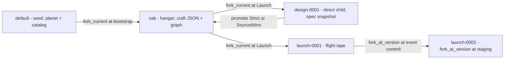

# strata-ksp: a mini Kerbal Space Program on Strata

| Field | Value |
|---|---|
| **Author** | TBD |
| **Date** | 2026-09-06 |
| **Status** | Draft |
| **Working title** | `strata-ksp` |
| **Repo path** | `strata-ksp` |
| **Sibling of** | `strata-colonies` |
| **Depends on** | `stratadb` at `../strata-core/crates/stratadb` (workspace 1.2.0 line) |
| **Audience** | Senior engineers who already know Strata V1 |

The talk line this demo exists to make true:

> I forked the launch at staging, added a tank, and the other timeline is still in orbit.

---

## Overview

Colonies already proved Strata can host twenty live branches, tick an event tape, rewind by scanning payloads, compare, and `verify_chain`. It barely touched graph, never called `promote`, and mixed three capabilities on every Game-of-Life tick because that *was* the stress. **strata-ksp is the complementary demo**: the craft is a property graph, the flight is a long honest event tape, rewind-then-append is a first-class verb, and a design that reached orbit is promoted onto the VAB with `PromotionStrategy::Strict` vs `SourceWins`.

The product is a local axum binary serving one vanilla canvas. You assemble a stick in a 2D VAB, launch it from a toy planet, watch a trajectory, stage, circularize, then fork the attempt at a past event sequence and fly a different burn while the parent branch keeps coasting.

**Strata is the world.** The integrator holds only the next-step registers (`r, v, mass, fuel, facing`) for ships that are still flying. Everything you can say in a sentence — hangar contents, flight tape, “where was it at T+21”, other attempts, promote — is a view over `stratadb`. The canvas is a tape player plus a live needle for the focused ship. Physics is a closed 2D Kepler problem specified below — not “we’ll figure it out.”

PR1–PR3 prove RK4 and Ascent-1 **in memory** (there is no hangar to persist yet). From **PR4 on** there is no parallel game state that can disagree with the database.

This is a **5-week, 9-PR** project at 1.0 FTE (the original 2–4 week packing was not realistic). Each PR is independently reviewable and leaves a runnable demo one step richer than the last.

---

## Background & Motivation

### What colonies already hit

`strata-colonies` (`strata-colonies`) drives `stratadb` as an embedded library:

- One `Database` behind a `Mutex`, because every service takes `&mut self` (`crates/engine/src/api/database.rs`).
- Per tick, three sequential capability acquisitions — `kv()` blob, `json()` status, `event().append` — because services cannot be held together (`colonies/src/store.rs` `write_board` / `write_status` / `append_tick`).
- `create_from_head` to fork twenty colonies from `default`.
- `event.range` scanned for `generation` to rewind; then a new `rewind` tick is appended (the log is never truncated).
- `verify_chain` as the audit button.
- Graph used once, as a static lineage sketch on the seed (`write_lineage_graph`), not as product state.
- `promote` unused. Cherry-pick / revert correctly treated as absent.

Colonies’ `findings.rs` already documents the constraints this plan must design around, not paper over.

### What KSP must hit that colonies did not

| Surface | Why KSP |
|---|---|
| **Graph** | The craft *is* a graph of parts. `GraphService::create_graph` / `batch_write` / `neighbors`. Staging deletes a subgraph. |
| **Long event tapes** | Telemetry (`tick`, `stage`, `flameout`, `orbit`, `crash`) with `verify_chain` as the black box. Not one event per GoL generation of a 64×48 bitset. |
| **Promote for real** | A craft that reached orbit is promoted onto `vab`. `Strict` vs `SourceWins`. |
| **Rewind then append** | Fork at a staging sequence; continue; the parent tape stays in orbit. Event log stays append-only and hash-linked. |
| **JSON** | Authored craft spec (part list, staging sequence, delta-v budget). |
| **KV** | One fat vessel snapshot for fast UI reload. Cache, not truth. |

### Pain if we copy colonies blindly

1. Colonies persist **every tick on every branch** (20 × 3 commits). A 60 Hz orbital sim cannot do that. Physics and persist must be decoupled.
2. Colonies’ rewind restores onto the **same** twenty branches. The KSP talk line needs **two live timelines**. That is `fork_current`, not in-place restore.
3. Colonies’ graph is decorative. Staging a rocket by `upsert_node` one-at-a-time will violate the “edges require both endpoints” rule and multiply commits. Use `GraphBatchWrite`.
4. `promote` is **not** all-capabilities. Graph and Event adapters set `supports_promotion() == false`; only JSON + KV (and vector, unused here) are carried. Direct `promote(launch, vab)` would still pollute the hangar with flight `meta` JSON and the KV `vessel` cache. Promote must be designed around the real carry set, and `resolve_base_point` only accepts a **direct** fork/merge parent.

---

## Goals & Non-Goals

### Goals

1. A talkable 2D launch-to-orbit demo on Strata branches, runnable with `cargo run` and a browser at `http://127.0.0.1:7430`.
2. Exercise, for real, the five capabilities: JSON (spec), graph (craft), event (tape), KV (snapshot), branches (fork / rewind-append / promote / compare / `verify_chain`).
3. A closed physics model an engineer can implement without a gamedev background: one planet, 2D planar motion, RK4, staged point-mass craft, derived orbit elements, win/fail predicates.
4. Distinctive mission-control UI in the same weight class as colonies: vanilla `index.html` / `style.css` / `app.js`, one canvas, axum, REST + WebSocket. No React, no Three.js.
5. Tests: physics unit tests, staging-mass unit tests, `open_cache` integration for in-process fork/persist/`verify_chain`, **durable `tempfile` + `open_local`** for resume/crash-restart, promote on a **direct child** of `vab`, a golden trajectory fixture.
6. Honest documentation of Strata constraints inside the demo (a findings strip, like colonies, but not the hero).

### Non-goals

- Not Minecraft, not a voxel engine, not a TypeScript/React app (Paint waits for a TS SDK).
- Not an agent-run harness, not plumbing-for-plumbing’s-sake.
- Not KSP 2: no patched conics, n-body, SAS PID beyond a snap-to-prograde hold, IVA, docking, resources other than fuel, science, contracts.
- Not a 3D VAB. Assembly is an ordered stack list.
- Not a network server, not multi-user, not production.
- Not live `strata` CLI inspection of `./ksp-db` while the demo holds the exclusive lock.
- No cross-capability atomic `CommitPlan` — it does not exist on the public surface; we will not pretend.
- Cherry-pick and revert stay absent (`crates/engine/tests/branch_merge_absence.rs`). We do not call them.
- No `fork_at_timestamp` in the demo. `BranchService::fork_at_version` / `fork_at_timestamp` **exist** in V1; we use `fork_at_version` for historical launch forks and leave `fork_at_timestamp` unused (commit time ≠ event occurrence time ≠ sim `t`). In-place rewind still cannot fork a branch onto itself; that path is rewind-append.

---

## Key Decisions

1. **Toy planet, not scaled Kerbin.** Kerbin’s 26-minute low orbit is a bad talk. Planet `kerb` has R = 200 m, g₀ = 9.81 m/s², µ = 392_400 m³/s², surface circular period ≈ 28.4 s, so a full orbit is visible. Catalog thrust/fuel is tuned so a 45 s ascent is interesting. See physics section.

2. **Decoupled thrust and fuel rate in v1.** Real Isp (200–400 s) on this planet produces escape velocity in the first seconds of a TWR-1.6 burn. Parts still *carry* an `isp` field for a later “real Kerbin” mode; v1 integration uses `thrust_n` and `fuel_rate_kg_s` independently. The golden Ascent-1 test is the acceptance gate for catalog numbers.

3. **Vacuum first.** Exponential atmosphere is a later PR (left as an open question). Win condition uses a vacuum margin: periapsis radius ≥ R + 24 m and e < 0.15.

4. **Events are the black box; KV is a cache; JSON is authored on VAB.** A crash between a KV put and an event append is a real invariant. Recovery replays events, then refreshes the KV snapshot. JSON spec is not written on persist ticks.

5. **One space, `flight`.** `ProductSpace::new("flight")` works without `spaces().create` (colonies used `"life"` the same way). Never introduce a second space.

6. **`default` is the immutable seed; `vab` is the hangar; `launch-NNNN` are flights.** `BranchService::delete` cannot delete `default` or the last branch. Launches never write on `default`.

7. **No in-process concurrent branch writers.** `Database` is exclusive `&mut self`. All launches serialize on one `Mutex<Database>`. Physics runs unlocked in memory. **One persist worker** drains a FIFO queue; the ticker never calls `event()` / `kv()` / `graph()` itself. Cap **8 live launches** (archive nudge beyond that).

8. **Store layer uses engine names.** CLI says fork/merge; we call `fork_current`, `fork_at_version`, and `promote`. `create_from_head` is an alias of `fork_current` (`crates/engine/src/branch/service.rs`).

9. **Historical launch fork = `fork_at_version` at the event’s storage commit.** V1 *does* expose `fork_at_version` / `fork_at_timestamp`. The slider is event-seq / sim `t`. `EventVersionedRecord::version()` is the `CommitVersion` of the append (`crates/engine/src/data/event/outcome.rs`). Fork-at looks up that seq via `event.get`, then `fork_at_version(parent, child, record.version())`. The child starts with JSON/graph/KV/events *visible at that commit*, not the parent’s abandoned future. Because we append the event **before** the KV put / graph write, the cache may be one persist stale — reconstruct kinematics from the child’s prefix tape. In-place rewind cannot use this API; that path is rewind-append plus the active-segment reconstruct. `fork_at_timestamp` stays unused. Do **not** stamp `cv` in the payload (the record already carries it; the payload is built before the commit exists).

10. **Promote carries JSON + KV only.** Graph and Event have `supports_promotion() == false` (`crates/engine/src/data/graph/adapter.rs`, `event/adapter.rs`). `plan_promotion` skips them; a promotion never copies or deletes event/graph rows. After a successful JSON promote onto `vab`, **rebuild `vab`’s `craft` graph from the spec** with the same `GraphBatchWrite` as VAB save. Direct `promote(launch, vab)` is refused by the store layer because it would carry flight `meta` JSON and KV `vessel` onto the hangar — not because it would merge the tape or spent graph (it would not).

11. **Promote source is `design-NNNN`, a direct child of `vab`.** `resolve_base_point` accepts only a direct fork or recorded merge parent, not grandparents (`preview.rs`; failure is `invalid_argument.engine.branch_point`). At every launch we `fork_current(vab, design-NNNN)`. On “promote this design” we write the winning spec onto that `design-*` branch, then `promote(design, vab, Strict|SourceWins)`. **Never delete `design-*` on promote** — `resolve_base_point` supports a second promote of the same source via the merge edge, and fork-at children share the parent’s `meta.design`. Delete a design only when the last live launch that lists it is archived, unless `keep_snapshot`. No `promo-*` grandchild. Compare reports graph/event diffs; preview/promote do not — the UI reads `PromotionOutcome::capabilities_unsupported` and does not pretend the graph arrived.

12. **JSON spec is the design source of truth; the graph is a projection.** VAB save writes JSON then rebuilds graph `craft`. Staging mutates the launch graph (and mass); adding a tank mid-flight updates JSON *and* rebuilds the graph. Promote does not move the graph; the hangar projection is rebuilt after JSON lands.

13. **Physics 60 Hz in-process; persist 4 Hz sim-time, ≤ 8 Hz wall across all branches.** One persist queue; discrete events (stage / win / fail / rewind / launch / edit) enqueue immediately and **drop any unsent coalesced tick** for that launch. **One tick = one `event.append` = one commit** so `EventSequence` and `CommitVersion` stay 1:1 for `fork_at_version`. Never `batch_append` ticks. Ticker wall period is `1000 / --hz` ms (default 30 Hz ≈ 33 ms), not 16 ms.

14. **RK4, dt = 1/60 s, 2D inertial frame.** Same integrator in the live sim and the golden fixture. Warp multiplies steps per UI frame, not `dt`. **2000 RK4 steps per wall tick is global**, round-robin across live launches, on a dedicated ticker task.

15. **One fat KV key `vessel`, never per-part KV.** `put_batch` pre-reads every key to flag create vs update (`KvService::put_batch`). It is already one commit; there is still no mixed put+delete batch (colonies finding). Colonies’ `--stress-cells` mode is exactly what we will not do.

16. **Library-opened DBs do not host IPC.** Document on the splash line: `strata ./ksp-db branch list` will not work while the demo holds the dir. Do not depend on it.

17. **Localhost-only bind default, cache-or-durable, rollback = delete the db directory.** No feature flags, no production rollout. `open_cache` is process-memory; crash-restart tests use `tempfile` + `open_local` only.

18. **Track engine friction as GitHub issues; do not patch the engine in this repo.** Workarounds in `store.rs` / `findings.rs` stay honest. The list lives in **Strata platform improvements** and is filed on `stratalab/strata-core` (colonies already opened 3126–3168; KSP added 3177–3180). strata-ksp is a V1 consumer.

19. **Registers vs store of record.** The CPU may hold integrator registers for live ships (≈ 8 floats × ≤ 8 launches) and a one-frame interpolation for the focused craft so 30 Hz UI does not wait on `Mutex<Database>`. It must not hold a second world: no shadow VAB spec, no canvas-owned `trail: Vec` that persist then has to catch up, no filmstrip array that can disagree with `branches().list()`. If it is not in Strata, it did not happen. PR1–PR3 are exempt (no database yet). From PR4, `/api/state` builds `trail` from the event tape (or `get_versions` on `vessel`); other launches on the filmstrip are last KV snapshot only; the VAB rail re-reads JSON/graph after every save.

---

## Proposed Design

### Repo layout

Sibling of colonies, not inside `strata-core`:

```
strata-ksp/
  Cargo.toml
  README.md
  src/main.rs            # axum, clap, routes, ws
  src/physics.rs         # RK4, gravity, orbit elements, win/fail
  src/craft.rs           # parts catalog, stack, mass, staging, Δv budget
  src/ascent.rs          # Ascent-1 autopilot (snap heading, no PID)
  src/store.rs           # stratadb adapter, capability-sectioned
  src/world.rs           # launches, tick, fork, rewind, promote, VAB
  src/telemetry.rs       # event payload shapes, sequence kinds
  src/findings.rs        # known engine constraints (colonies pattern, quieter)
  static/index.html
  static/style.css
  static/app.js
  tests/physics.rs
  tests/craft.rs
  tests/persist.rs
  tests/golden.rs
  fixtures/sounding-stick-ascent1.json   # golden samples
```

`Cargo.toml` mirrors colonies:

```toml
[package]
name = "strata-ksp"
version = "0.1.0"
edition = "2021"
rust-version = "1.91"
license = "Apache-2.0"
publish = false
description = "Assemble a rocket, fork the launch, watch the other timeline stay in orbit"

[[bin]]
name = "ksp"
path = "src/main.rs"

[dependencies]
stratadb = { path = "../strata-core/crates/stratadb" }
axum = { version = "0.8", features = ["ws"] }
clap = { version = "4.5", features = ["derive"] }
serde = { version = "1", features = ["derive"] }
serde_json = "1"
tokio = { version = "1", features = ["full"] }

[dev-dependencies]
tempfile = "3"
```

Binary name `ksp`, default bind `127.0.0.1:7430` (colonies is `7420`), default db `./ksp-db`. `--cache` for `Database::open_cache`.

If `store.rs` exceeds ~500 LOC during the persist PRs, split into `src/store/{mod,kv,json,event,graph,branch}.rs` in the same PR that tips it over. Do not start with a kitchen drawer.

### Architecture

```mermaid
flowchart TB
  subgraph ui [Browser - vanilla]
    canvas[Canvas: planet + trajectory]
    vab[VAB stack list]
    film[Launch filmstrip]
    transport[Warp / stage / fork / rewind / promote]
  end

  subgraph bin [ksp binary]
    axum[axum REST + WebSocket]
    world[World]
    phys[physics.rs RK4]
    craft[craft.rs]
    mem[Mutex of in-memory Launch / Vab]
    dbm[Mutex of Database]
    store[store.rs]
  end

  subgraph strata [stratadb]
    json[JsonService - craft spec]
    graph[GraphService - craft graph]
    event[EventService - tape]
    kv[KvService - vessel snapshot]
    br[BranchService - fork / promote / compare]
  end

  canvas --> axum
  vab --> axum
  film --> axum
  transport --> axum
  axum --> world
  world --> phys
  world --> craft
  world --> mem
  world --> dbm
  dbm --> store
  store --> json
  store --> graph
  store --> event
  store --> kv
  store --> br
```

Physics never waits on persist. Persist never runs inside the RK4 loop. The ticker is a dedicated tokio task (colonies pattern). Wall period is `1000 / hz` ms (default **33 ms** at `--hz 30`). Steps per frame = `warp * 60 / hz` (2 RK4 steps/frame at 1× / 30 Hz).

```mermaid
sequenceDiagram
  participant Ticker
  participant World
  participant Mem as In-memory Launch
  participant Phys as physics::step
  participant Q as Persist queue FIFO
  participant Worker as persist worker spawn_blocking loop
  participant DB as Mutex Database

  Ticker->>World: wall tick (33 ms at 30 Hz)
  World->>Mem: lock launches
  loop min(remaining, global 2000-step budget) round-robin
    World->>Phys: RK4 dt=1/60
    Phys-->>Mem: r,v,fuel,stage
    opt stage / crash / orbit / edit
      Note over Mem,Q: snapshot taken under launches; pending tick dropped
      World->>Q: enqueue Discrete(snapshot)
    end
  end
  opt sim_t - last_persist >= 0.25s AND worker wall rate < 8 Hz
    World->>Q: enqueue Tick(snapshot) if no pending Discrete
  end
  World-->>Ticker: snapshot to broadcast
  Worker->>Q: recv (FIFO = enqueue order)
  Worker->>DB: event() then kv() then maybe graph()
  Note over Worker: last_event_seq from EventAppendOutcome, not the pre-copy
```

### Strata adapter rules (store.rs)

These are load-bearing. Put them in a module-level comment in `store.rs`.

1. `Database` is exclusive `&mut self`. `World` holds `Mutex<Database>`. **One persist worker** (a loop inside `spawn_blocking` or a dedicated thread) is the only task that acquires it for writes. HTTP handlers that read/write the db also `spawn_blocking` and take the same mutex. Never hold the db mutex across an `.await`. The ticker never calls `event()` / `kv()` / `graph()`.
2. `kv()`, `json()`, `event()`, `graph()`, `branches()` each borrow `Database` mutably (`database.rs` 287–373). They **cannot be held together**. One logical flight tick is **multiple commits**.
3. There is no public cross-capability `CommitPlan`. A crash between KV snapshot and event append is real. **Events win.** On open/resume, replay the tape to rebuild vessel state, then rewrite the KV snapshot.
4. `EventPayload::new` requires a JSON **object** and rejects non-finite floats (`crates/engine/src/data/event/types.rs`). Telemetry is an object of numbers. No NaN. No top-level arrays. No binary; if we ever stored a packed trail, it would be base64 inside the object (colonies’ board trick) — we will not, because the trail is reconstructed from ticks.
5. `EventService::range` is latest-only; it has no as-of twin. `range_by_time` filters on **event occurrence time**, not commit as-of. Rewind keys off **event sequence** (`EventSequence`) plus payload field `t` (sim time). Fork-at keys off `EventVersionedRecord::version()` for that sequence.
6. `BranchService::delete` refuses `default` and the last active branch (`invalid_argument.engine.branch_delete`).
7. `create_from_head` ≡ `fork_current`. Historical launch forks call `fork_at_version`. In-place rewind does not fork.
8. `put_batch` pre-reads every key to flag create vs update. It is already a single commit; there is no mixed put+delete batch. One fat `vessel` key.
9. Library-opened DBs do not host IPC. Do not tell the UI to shell out to `strata`.
10. Graph edges require both endpoint nodes to exist. `GraphBatchWrite` is all-or-nothing (KV `put_batch` is one commit of puts only — not a mixed put+delete). Staging and VAB rebuilds go through `batch_write`, with `UpsertNode` ops **before** `UpsertEdge` ops in the same batch (`GraphService::batch_write` applies in order against an in-memory map).
11. `ProductSpace::new("flight")` once, everywhere. `KvKey::new` takes bytes: `KvKey::new(b"vessel".as_slice())` — a string literal does not compile (colonies finding; `stratadb` crate docs still show `KvKey::new("greeting")`).
12. `json.set_or_create` takes `&JsonPath` (`json/service.rs` 141–145). Call sites copy colonies: `json.set_or_create(id, &JsonPath::root(), value)`.
13. `promote` carries JSON + KV only. After promoting craft JSON onto `vab`, rebuild the hangar graph. `preview`/`promote` will not report graph or event conflicts; `compare` will.

Helper constructors live next to the constants:

```rust
pub const SPACE: &str = "flight";
pub const GRAPH_CRAFT: &str = "craft";
pub const DOC_CRAFT: &str = "craft";
pub const DOC_CATALOG: &str = "catalog";
pub const DOC_PLANET: &str = "planet";
pub const DOC_META: &str = "meta";
pub const KV_VESSEL: &[u8] = b"vessel";
pub const BRANCH_DEFAULT: &str = "default";
pub const BRANCH_VAB: &str = "vab";

pub fn space() -> Result<ProductSpace, stratadb::EngineError> {
    ProductSpace::new(SPACE)
}
pub fn branch(name: &str) -> Result<BranchName, stratadb::EngineError> {
    BranchName::new(name)
}
```

`World::open` chooses:

```rust
if cache {
    Database::open_cache(CacheOpenOptions::new())?.into_database()
} else {
    Database::open_local(path, DurableLocalOpenOptions::new())?.into_database()
}
```

### Branch topology



| Branch | Role | JSON | Graph | Events | KV | Deletable |
|---|---|---|---|---|---|---|
| `default` | Immutable seed. Planet constants, parts catalog. | `planet`, `catalog` | none | none | none | **No** |
| `vab` | Hangar. Authored spec. | `craft`, `meta` | `craft` (projection) | `vab_save` / `promoted` | none | Not in v1 UI |
| `launch-NNNN` | One attempt. | frozen spec (mutated only on “add tank”) | live craft, staging deletes | the tape | `vessel` snapshot | Yes |
| `design-NNNN` | **Mandatory** hangar snapshot, created at every launch. Direct child of `vab`. Promote source. Shared by fork-at children. | `craft` only (do not write `meta` or `vessel`) | projection, unused by promote | none | **none** | **Not on promote.** Delete when the last live launch whose `meta.design` names it is archived, unless `keep_snapshot`. |

There is **no** `promo-*` branch. A grandchild of `vab` cannot `promote` into `vab` (`invalid_argument.engine.branch_point`).

**`design-*` lifetime (reference counted):**

```text
refcount(design) = count of live launch-* branches whose json meta.design == design
delete_design(design):
  if keep_snapshot: return
  if refcount(design) > 0: return
  branches.delete(design)   # vab + default keep the last-branch rule
```

Promote never calls `delete_design`. Archive of a launch decrements the count and may then delete. Fork-at **shares** the parent’s `meta.design` (copied by `fork_at_version`); it does **not** allocate `design-new`. Sharing keeps the merge-base at launch-time `vab`, which is the Strict demo against hangar edits during the flight. A new design at fork-at time would move the merge-base and hide those edits.

Launch names are monotonic `launch-0001`, … never reused. Design names `design-0001`, … likewise. Counters live on `vab` `meta.next_launch` and `meta.next_design` so resume after process restart does not collide. Filmstrip lists `vab` + `launch-*` only; `design-*` is hidden unless `keep_snapshot`. `POST /api/audit` verifies `vab` and every `launch-*`.

### Data written at each verb

#### VAB save (`POST /api/vab/save`)

On branch `vab`, space `flight`, **three commits** (json, then graph, then a single event):

1. `json.set_or_create(JsonDocumentId::new("craft")?, &JsonPath::root(), JsonValue::new(spec)?)`
2. `graph.create_graph(GraphName::new("craft"))` if missing (`already_exists.engine.graph` is OK). Then one `graph.batch_write` that deletes unknown nodes and upserts the spec’s nodes+edges.
3. `event.append(EventType::new("vab_save"), payload)` with `{ "t": 0, "parts": N, "dv_budget": ... }`.

Planet + catalog are written **once** on `default` at bootstrap, not on every save.

#### Launch (`POST /api/launch`)

1. Persist any dirty VAB spec (the save path above) so both forks see it.
2. `branches.fork_current(&vab, design-NNNN)` — frozen hangar snapshot, **direct child of `vab`**, JSON `craft` only. Do not write `meta`, KV, or events on `design-*`.
3. Increment `vab` `meta.next_launch` and `meta.next_design` (one JSON commit on `vab`). This is a hangar-only `meta` change; `design-*` must not copy it back on promote.
4. `branches.fork_current(&vab, launch-NNNN)`.
5. On the launch branch, **do not rewrite the craft JSON or graph** — they come with the fork. Write launch `meta` (`name`, `parent: "vab"`, `design: "design-NNNN"`, `status: "boost"`, `warp`, `autopilot: true`).
6. Initialize in-memory vessel at the pad. Enqueue a Discrete persist: `event.append("launch", { t, x, y, craft_hash, parent, design })` then `kv.put(vessel, snapshot)`.
7. If live launches would exceed 8, refuse with a demo error and an archive nudge; do not fork.

Fork copies the VAB’s `vab_save` events onto the launch branch. That is acceptable: a short prefix, then the flight tape. Do not append ticks on `vab`. `design-*` is not shown on the filmstrip.

#### Persist worker (required; this is how we do not race ticks against stages)

Colonies never had this problem: persist *was* the tick, under one `db` lock, after boards were computed. We have a 60 Hz unlocked physics loop and an 8 Hz writer. Independent `spawn_blocking` calls can commit a pre-stage tick **after** a stage.

**Rules:**

1. One `std::sync::mpsc` (or `tokio::sync::mpsc`) FIFO of `PersistJob`. One worker loop is the sole writer.
2. Snapshot is copied **and the job is sent while holding `launches`**. Channel order = mutex order. Then drop `launches`, then the worker takes `db`.
3. Each `Launch` holds `pending_tick: Option<PersistJob>`. A Discrete enqueue sets `pending_tick = None` (drops an unsent coalesced tick). A Tick enqueue replaces `pending_tick` (coalesce by **dropping** the older unsent sample, not by packing two samples into one commit). After physics, the ticker sends `pending_tick` if the sim-time and wall-rate caps allow.
4. A Tick already in the channel cannot pass a later Discrete: both were sent under `launches`, Discrete after Tick in FIFO, which is the correct tape order.
5. Worker stamps KV `last_event_seq` from **this job’s** `EventAppendOutcome::sequence()`, never from the in-memory copy’s previous seq.
6. Worker wall-rate cap: ≤ 8 Hz across **all** branches for Tick jobs. Discrete jobs are never delayed by the cap.
7. The ticker never calls `event()`.
8. **`PersistJob` carries an optional oneshot ack.** After the worker finishes this job’s commits (or fails), it sends `PersistAck { seq, result }` on the oneshot. Callers that need a durable head — `fork_at_version`, promote’s `json.get(launch, craft)`, archive — call `flush_durable(launch)`: enqueue the pending Tick/Discrete **with an ack**, drop `launches`, **block on the ack**, then take `db` for the read/fork. Enqueue without an ack is not durability. HTTP handlers do this inside `spawn_blocking`.

```rust
struct PersistAck {
    seq: EventSequence,
    result: Result<(), stratadb::EngineError>,
}
struct PersistJob {
    launch: String,
    kind: PersistKind, // Tick | Discrete { .. }
    sample: VesselSample,
    ack: Option<tokio::sync::oneshot::Sender<PersistAck>>,
}
```

#### Per persist tick (steady flight)

**Two commits**, always in this order, inside the worker:

1. `event.append("tick", sample_object)` — source of truth. Do not put `cv` in the payload (`EventPayload` is built before the commit). Fork-at reads `EventVersionedRecord::version()` from `range`.
2. `kv.put(vessel, snapshot_bytes)` — cache. Snapshot includes `last_event_seq` from step 1 (`EventAppendOutcome::sequence()`).

Never write JSON or graph on a tick. Discrete events (`stage`, `flameout`, `orbit`, `crash`, `rewind`, `launch`, `edit`) are their own appends and are never batched with ticks.

**Do not `batch_append` ticks.** One tick = one commit keeps `EventSequence` and `CommitVersion` 1:1, which `fork_at_version(parent, child, record.version())` requires. Under warp, coalesce by dropping unsent `pending_tick` samples (the 4 Hz / 8 Hz caps already bound write rate). A `batch_append` of seq 40–47 would share one `CommitVersion`; the child tape would then include every event in that commit, not `[0, at_seq]`.

#### Staging (`POST /api/stage` or autopilot)

1. In memory, under `launches`: drop the spent stage, recompute mass, zero that engine’s thrust. Clear `pending_tick`. Send a Discrete job (snapshot + `graph_ops` deletes).
2. Worker, **three commits**:
   1. `event.append("stage", { t, dropped: [...], mass })`
   2. `graph.batch_write` `DeleteNode` for each dropped part (incident edges go with the node — `DeleteNode` in a batch does the same).
   3. `kv.put(vessel, snapshot)` with `last_event_seq` from step 1.
3. JSON spec is **not** rewritten on a normal stage (the spec still describes the original stack; the graph describes the live vessel). The payload of `stage` is enough to replay.

#### Add-a-tank at staging (the talk move, on the **child** branch)

1. User has already `fork_at_version` so this launch is at the staging sample (boost still on the stack).
2. Insert `tank-s` (or `tank-m`) into the in-memory stack above the current engine, recompute mass/fuel.
3. Enqueue Discrete: JSON spec rewrite + graph rebuild + `event.append("edit", { t, op: "add_tank", part })` + KV snapshot. Four commits. Rare.

#### Fork-at (`POST /api/fork`)

`BranchService::fork_at_version` / `fork_at_timestamp` exist. We use **version**, not timestamp: the slider is event-seq / sim `t`, and `range_by_time` is event occurrence time, not commit as-of.

```mermaid
sequenceDiagram
  participant UI
  participant World
  participant Q as Persist queue
  participant DB as BranchService
  participant Child as launch-0002

  UI->>World: fork { from: launch-0001, at_seq: 47 }
  World->>Q: flush_durable(0001) — enqueue pending with oneshot, wait ack
  World->>World: event.get(seq 47); cv = record.version()
  World->>DB: fork_at_version(launch-0001, launch-0002, cv)
  Note over DB: Child latest = rows visible at that commit. Tape is the prefix. meta.design is still design-0001 (shared).
  World->>Child: reconstruct(prefix)  (events-as-truth; KV cache may be one tick stale)
  World->>Child: enqueue Discrete fork { parent, at_seq } with ack
  World->>Q: wait ack
  World-->>UI: two filmstrip rows; 0001 still coasts; both list design-0001
```

If seq 47 is not on the parent tape, **fail**. Do not silently `fork_current` — that would inherit the parent’s future tape and reintroduce the reconstruct bugs below.

**Fork-at shares the parent’s design.** `fork_at_version` copies launch JSON `meta.design`. Do not `fork_current(vab, design-new)`: that would move the promote merge-base to fork-at time and hide hangar edits made during the original flight (the Strict demo). Omit `at_seq` (fork at head) still goes through `flush_durable` so the parent’s last coasting tick is in the prefix.

Parent is not paused unless the user pauses it. That is the talk.

`fork_at_timestamp` is not used. Commit timestamps are not sim `t`.

**In-place rewind** (`POST /api/rewind`): reconstruct with the active-segment algorithm, append `rewind { to_seq, t }`, `kv.put`, rebuild graph from original spec + *active* `stage`/`edit` ops. The abandoned future stays on the tape (honest, `verify_chain`-able). UI scrubber treats the latest `rewind` as the origin of the active timeline; the audit view shows the whole chain.

On fork-at and in-place rewind, **treat KV as suspect** until the worker’s `kv.put` of the reconstructed snapshot lands. Resume rule: if the head event is `rewind` **or** `snap.seq` is not in the active segment, ignore KV and fully reconstruct, then repair graph + KV.

#### Promote (`POST /api/promote`) — button label: **Promote this design**

**Never** `promote(launch-NNNN, vab)`. Store layer returns a demo-level error if asked. Reasons, given the real carry set (JSON + KV only):

- Launch `meta` (`{name, status, design, …}`) vs hangar `meta` (`{next_launch, next_design}`) is a near-certain `ValueDivergence`.
- KV `vessel` *is* promotable and would land on `vab`.
- Graph and events would **not** land (`supports_promotion() == false`). Staging would **not** delete VAB parts via promote. Saying otherwise is wrong.

`resolve_base_point` requires a **direct** fork/merge parent. `promote(grandchild, vab)` is `invalid_argument.engine.branch_point`. Do not fork a `promo-*` from `design-*`.

```text
promote_this_design(source_launch, target=vab, strategy):
  flush_durable(source_launch)           # wait ack; a child edit may still be queued
  design = launch.meta.design            # design-NNNN, forked from vab at launch
  spec   = json.get(source_launch, "craft")   # winning spec (maybe extra tank)
  json.set_or_create(design, &JsonPath::root() on "craft", spec)
      # do not write meta, KV, or events on design
  outcome = branches.promote(design, vab, strategy)
      Strict     -> conflict.engine.promotion if vab.craft changed since
                    design's fork (a hangar edit during the flight).
                    Zero target mutation.
      SourceWins -> overwrite craft JSON; PromotionOutcome.applied lists it.
                    A later promote of the same design uses the merge-edge
                    branch point (resolve_base_point first arm).
  # Graph did not move. Rebuild vab craft graph from the *promoted* spec.
  graph.batch_write vab craft from spec
  # DO NOT delete(design). Live launches (this one, fork-at children) still
  # list it in meta.design. Second promote / 0002 promote need the branch.
  event.append on vab "promoted" { source_launch, design, strategy, ok,
                                   unsupported: outcome.capabilities_unsupported }
```

Talk beat that actually exercises Strict: while `launch-0001` coasts, add a fin on the hangar and Save. Then Promote this design / Strict → `conflict.engine.promotion`. Flip to SourceWins → hangar becomes the orbiting spec, fin is lost, **`design-0001` remains**. Scrub staging → fork (shares `design-0001`) → add tank → Promote this design on 0002 succeeds.

`preview` (`BranchService::preview`) may back a dry-run, but it **will not** list graph/event conflicts. `compare` will. The UI must not treat compare as a promote preview. Read `PromotionOutcome::capabilities_unsupported` (Event, Graph) and show a paper note: *Strata promoted the JSON spec; the hangar graph was rebuilt from it.*

Do not start the promote PR until a spike has actually called `promote(design, vab)` on a direct child and observed `conflict.engine.promotion` vs `invalid_argument.engine.branch_point` on a grandchild.

### Physics (closed model)

All SI. 2D inertial frame, planet at the origin, no rotation, no n-body. Camera may rotate to keep “up” as radial for a side-view; that is a view transform, not a rotating frame.

#### Planet `kerb`

| Quantity | Symbol | Value | Notes |
|---|---|---|---|
| Radius | R | **200 m** | Toy world, canvas-friendly |
| Surface gravity | g₀ | **9.81 m/s²** | Familiar number |
| Standard grav. parameter | µ | **g₀ R² = 392_400 m³/s²** | Kepler-consistent |
| Atmosphere | — | **none in v1** | Open question |
| Win periapsis radius | r_pe,min | **R + 24 = 224 m** | Vacuum margin |
| Win eccentricity | e_max | **0.15** | “Nearly circular” |
| Fail lithobrake | | **\|r\| < R** | Instant crash |
| Escaped (not a fail) | | **\|r\| > 20 R** | Stop integrating, status `escaped` |
| Pad position | r₀ | **(0, 200)** | +y is north |
| Pad velocity | v₀ | **(0, 0)** | |
| Pad facing | û | **r̂ = (0, 1)** | Radial out |
| “East” | | **+x** | Gravity-turn target |

Derived, not stored:

- Surface circular velocity `sqrt(µ/R) = 44.27 m/s`
- Surface period `2π sqrt(R³/µ) = 28.37 s`
- Circular at r = 240 m: `v = 40.43 m/s`, `T = 37.30 s`
- Escape at surface `sqrt(2µ/R) = 62.61 m/s`

A 60-second talk sees a launch (~15–25 s sim) plus at least one orbit at 2–4× warp.

#### Integrator

**RK4**, `dt = 1/60 s` exactly (`DT = 1.0 / 60.0`). Same function for live, warp, tests, golden.

```text
a(r, v, t) = gravity(r) + thrust(facing, throttle, stage) / mass
gravity(r) = -µ r / |r|³

k1v = a(r, v, t);            k1r = v
k2v = a(r+½dt k1r, v+½dt k1v, t+½dt); k2r = v+½dt k1v
k3v = a(r+½dt k2r, v+½dt k2v, t+½dt); k3r = v+½dt k2v
k4v = a(r+dt k3r, v+dt k3v, t+dt);    k4r = v+dt k3v
v ← v + dt/6 (k1v + 2 k2v + 2 k3v + k4v)
r ← r + dt/6 (k1r + 2 k2r + 2 k3r + k4r)
```

Fuel is Euler-integrated at the same `dt` (not RK4): `fuel ← max(0, fuel - throttle * fuel_rate * dt)`. Mass is `stack_dry_current + fuel`. If `fuel == 0`, thrust is zero and we emit `flameout` once.

Facing does **not** have angular inertia. Autopilot or the user snaps `facing` to a unit vector each step (prograde, radial, or a held angle from +x). No PID, no torque, no fins. Fins are catalog no-ops so the VAB can look like a rocket.

**Stability bounds** (checked after every step):

- If any of `{x,y,vx,vy,mass,fuel}` is non-finite → `crash` with reason `numeric`.
- If `mass <= 0` → same.
- If `|r| < R` → `crash` lithobrake.
- If `|r| > 20 R` → `escaped`, stop.
- Warp may run at most **2000 RK4 steps per wall tick globally** (≈ 33 s sim at 60 Hz), **round-robin** across live launches, on the dedicated ticker task. Excess is deferred. This is not per-launch: 8 launches × 2000 would stall axum if the ticker shared the runtime’s blocking pool; the ticker task is dedicated and the cap is global.

**Time warp.** Warp ∈ {1, 2, 4, 10, 50}. Warp multiplies **step count**, never `dt`. Energy error stays that of RK4 at 1/60. Persist cadence is on sim time, with a wall-rate cap of **8 Hz across all branches**. Live launches are capped at **8**; the ninth Launch is refused with an archive nudge.

#### Orbit elements (2D)

Let `r_vec = (x, y)`, `v_vec = (vx, vy)`, `r = |r_vec|`, `v² = vx²+vy²`.

```text
h = x*vy - y*vx                         # specific angular momentum (scalar)
ε = v²/2 - µ/r                          # specific energy
e_x =  (vy * h)/µ - x/r                 # eccentricity vector
e_y = (-vx * h)/µ - y/r
e = sqrt(e_x² + e_y²)

if ε < 0:
    a = -µ / (2ε)
    r_pe = a * (1 - e)
    r_ap = a * (1 + e)
else:
    a = +∞
    r_pe = h² / (µ (1 + e))             # hyperbola periapsis
    r_ap = +∞
```

Altitudes shown in the UI: `h_pe = r_pe - R`, `h_ap = r_ap - R`. Predicted orbit drawn as the Kepler conic through current `r,v` (dashed), independent of the recorded trail.

**Win** (sticky, emitted once as `orbit`): `r_pe ≥ 224` **and** `e < 0.15` **and** `ε < 0` **and** not currently thrusting required — we do **not** require cutoff, but Ascent-1 cuts off. Status stays `orbit` even if a later burn ruins it; a new `crash` can still fire.

**Fail:** lithobrake. **Soft fail** `suborbital`: `fuel == 0`, all engines flamed out, `r_pe < 224`, not yet `orbit`. Still integrating until crash or escape; UI badges it.

#### Craft as point mass

The vessel is a point at `r` with mass `m = dry(live parts) + fuel(live tanks)`. Thrust is along `facing`, magnitude `throttle * sum(thrust_n of live engines in the current stage)`. Only the **lowest live engine group** (the current stage) fires. No gimbal.

#### Staging mass

A stack is an ordered list of parts, bottom to top. **One staging rule** (document in `craft.rs`, test in `tests/craft.rs`):

> A stage is the prefix through the lowest remaining decoupler, or the **entire remaining stack** if there is no decoupler.

KSP convention: the lowest stage fires first.

```text
Sounding Stick, bottom → top:
  [lvt-30, tank-m, stack-sep]   stage A (boost)     — prefix through first sep
  [terrier, tank-s, stack-sep]  stage B (circularize)
  [mk1-pod]                     stage C (payload)   — no sep left; stage() drops the pod
```

`stage()` drops every part in that prefix, including the decoupler. Dry mass and fuel capacity fall with them. Residual fuel in dropped tanks is discarded (emitted in the `stage` payload as `dropped_fuel`). Staging a stack with no decoupler drops everything, including the capsule; mass hits 0 and the next physics step is `crash` / `numeric`. Autopilot must not do that: Ascent-1 only stages when “the current stage still has a spent engine **and a decoupler**.” Manual Stage on a sep-less stick is allowed and tested.

`[lvt-30, tank-m, mk1-pod]` (VAB with seps removed): first `stage()` drops all three parts.

### Parts catalog (hardcoded)

IDs are stable strings; they are graph node prefixes and JSON `part_id`s.

| id | kind | dry kg | fuel cap kg | thrust N | fuel_rate kg/s | isp (unused in v1) |
|---|---|---|---|---|---|---|
| `mk1-pod` | capsule | 0.80 | 0 | 0 | 0 | — |
| `tank-s` | tank | 0.30 | 0.90 | 0 | 0 | — |
| `tank-m` | tank | 0.50 | 1.80 | 0 | 0 | — |
| `lvt-30` | engine | 0.40 | 0 | **80** | **0.22** | 14 |
| `terrier` | engine | 0.25 | 0 | **28** | **0.08** | 22 |
| `stack-sep` | decoupler | 0.05 | 0 | 0 | 0 | — |
| `fin` | fin | 0.03 | 0 | 0 | 0 | — |

`isp` is serialized and shown in the VAB tooltip but **v1 acceleration uses `thrust_n` and `fuel_rate`**. Do not compute `ṁ = F/(Isp g₀)` in v1.

**Sounding Stick** wet mass = 0.40+0.50+1.80+0.05+0.25+0.30+0.90+0.05+0.80 = **5.05 kg**.

- Pad TWR = 80 / (5.05 × 9.81) = **1.61**
- Boost burn time = 1.80 / 0.22 = **8.18 s**
- After boost drop (lose engine 0.40 + tank dry 0.50 + sep 0.05 + 1.80 fuel): remaining 2.30 kg
- Upper TWR = 28 / (2.30 × 9.81) = **1.24**
- Upper burn = 0.90 / 0.08 = **11.25 s**

These numbers are the **initial catalog**. **PR3 is the only catalog/golden-tuning PR**: `Sounding Stick` + Ascent-1 must reach win in t ∈ (20, 45) s and never `|r| > 8 R`. Thrust/fuel may move ≤ 2× in PR3 without a schema change. Planet constants are frozen. **PR4 must not retune thrust.** After PR9 freeze, catalog is treated like planet (version mismatch ⇒ delete `./ksp-db`).

#### Ascent-1 autopilot (no PID)

A closed program so the talk does not depend on a hot-seat pilot. Heading is snapped, not filtered.

```text
state boost:
  throttle = 1
  if t < 2.0:           facing = r̂                         # vertical
  else if t < 8.0:      facing = slerp(r̂, east_horizon, (t-2)/6)
  else:                 facing = prograde (v̂); if |v|<1, facing = r̂
  if h_ap >= 28 m:      throttle = 0; goto coast            # apoapsis target

state coast:
  throttle = 0
  facing = prograde
  if current stage still has a spent engine AND a decoupler: stage  # never stage the pod
  if radial_speed ≈ 0 (r·v / |r| < 0.5 m/s) and h_ap >= 24: goto circ
  if t > 40: goto circ anyway

state circ:
  if current stage is boost remnant: stage
  throttle = 1
  facing = prograde
  if e < 0.15 and r_pe >= 224: throttle = 0; win
  if fuel == 0: flameout
```

`east_horizon` is `(-r̂_y, r̂_x)` or `(r̂_y, -r̂_x)` chosen so the x-component is positive at the pad (we burn east, +x).

The user can toggle autopilot off and set throttle / facing / stage manually. Inputs are recorded as `control` events so a rewind+replay of *user* flights is possible; Ascent-1 is a pure function of `(t, vessel)` and does not need those events.

### Persistence cadence and source of truth

| Clock | Rate | Notes |
|---|---|---|
| Physics | 60 Hz sim | RK4, always |
| UI snapshot / WS | ~30 Hz wall | focused ship: last KV snapshot + integrator registers; others: last snapshot; `trail[]` from the tape |
| Tick events + KV | every **0.25 s sim** | 4 Hz at 1× warp |
| Wall persist cap | **≤ 8 Hz** | under 50× warp, skip intermediate ticks; never skip `stage`/`orbit`/`crash`/`flameout`/`rewind`/`launch` |
| JSON / graph | on VAB save, add-tank, staging (graph only) | not on ticks |

**Non-atomicity protocol**

```text
writer order on a persist tick (worker):
  1. event.append tick        # truth moves forward
  2. kv.put vessel            # cache, last_event_seq = append outcome

resume:
  head = event.range reverse limit 1
  snap = kv.get vessel
  if head is rewind
     or snap missing
     or snap.seq is not in the active segment of the tape:
      IGNORE kv; reconstruct(head.seq) from events; repair kv + graph
  else if snap.seq < head.seq:
      reconstruct from snap.seq exclusive to head using the active segment
      kv.put vessel
  graph is never truth: rebuild_graph_from_spec_and_active_ops after reconstruct
```

If we crash after (1) and before (2), resume sees a stale snapshot and replays — correct, **provided** replay uses the active-segment algorithm, not “all events then skip rewind.”

If we crash during staging after the `stage` event but before graph `batch_write`, resume rebuilds the live graph from original spec + **active** `stage`/`edit` ops.

**Active-segment reconstruction**

Kinematic `tick` samples are absolute (`x,y,vx,vy,fuel,mass,stage`). Skipping a `rewind` and applying later ticks is fine for kinematics. It is **wrong** for `stage` / `edit`: those are mutations, and a rewind to pre-stage must *not* keep the drop.

```text
active_events(events[0..=seq]):
  active = []
  for e in events:
    if e.type == rewind:
      active.retain(|x| x.seq <= e.to_seq)   # drop the abandoned future
      # rewind itself is not a mutation
    else:
      active.push(e)
  return active

reconstruct(branch, seq):
  pages = event.range(EventSequence::new(0), Some(seq+1), None, Forward, None)
  launch_ev = first event of type "launch" in pages   # fail if missing
  spec0 = json.get_at_version(
              JsonDocumentId::new("craft")?,
              &JsonPath::root(),
              launch_ev.version())     # CommitVersion of the launch append
          .ok_or("craft missing at launch commit")?
  # The launch payload is { t, x, y, craft_hash, parent, design } — no part list.
  # Latest json.get("craft") is wrong after an edit. design-* may already hold a
  # promoted winning spec, so it is not spec0 either.
  spec = spec0
  vessel = pad_state(spec0)
  stage_ops = []
  for e in active_events(pages):
    match e.event_type():
      launch | tick     => apply_sample(vessel, payload)   # absolute kinematics
      stage             => apply_stage(vessel, payload); stage_ops.push(e)
      edit              => spec = apply_spec_mutation(spec, payload)
      flameout | orbit | crash | control | fork | vab_save | promoted => side effects
  rebuild_graph_from_spec_and_active_ops(spec0, spec, stage_ops)
  return (vessel, spec)
```

Worked counterexample the naive skip-rewind path gets wrong:

1. Events 0–50 ticks (boost), 51 `stage` (graph `DeleteNode` boost), 52–80 ticks (upper), rewind to seq 10, then 81+ ticks (boost again).
2. `reconstruct(90)`: rewind drops everything with seq > 10 from `active`, then keeps 81–90. No `stage` op remains. Graph has boost nodes. Vessel kinematics come from tick 90 (absolute).
3. `reconstruct(60)` (scrub, no rewind in range): `stage` at 51 applies. Graph is upper-only.

`rebuild_graph_from_spec_and_active_ops`: start from `spec0` node set, apply `edit` ops to the spec, apply `stage` drops to the live node set, then one `GraphBatchWrite` (delete nodes not in the live set, upsert the live set, edges after nodes). Call on resume, in-place rewind, and fork-at (the last is usually a no-op because `fork_at_version` already has graph as-of `cv`).

`kv.get_at` is commit-timestamp as-of, **not** event-sequence as-of. Only use it when the snapshot embeds `seq` equal to the target **and** that seq is in the active segment. Tests must pass with KV disabled (replay-only) so the cache never becomes load-bearing.

Persist tests that must exist:

- (a) `fork_at_version` at a pre-stage seq; kill before child `kv.put`; resume child still at staging kinematics with **boost nodes present**.
- (b) in-place rewind past a `stage`; graph has the dropped nodes again; later ticks after the rewind event have restored `t`.
- (c) add-tank, in-place rewind to a pre-edit seq; spec and graph match the original stick (`get_at_version` spec0, not latest JSON).

Colonies scanned up to 4096 events looking for `generation`. We key off `EventSequence` directly (`range` start/end), which is O(page) and does not require payload search. Keep `t` in the payload for the UI slider.

**Storage estimate**

Tick payload is a JSON object of ~12 numbers + a few strings ≈ **220–350 bytes** encoded.

| Scenario | Samples | Payload | With MVCC / hashes / commits (× ~4) |
|---|---|---|---|
| One 60 s launch at 4 Hz | 240 ticks + ~6 discrete | ~80 KB | **~0.3 MB** |
| 20 launches × 60 s | 4800 | ~1.6 MB | **~6 MB** |
| One 10 min coast at 4 Hz | 2400 | ~0.8 MB | **~3 MB** |
| 50× warp, 10 min, cap 8 Hz **wall** | ~4800 wall-capped | ~1.6 MB | **~6 MB** |

KV `vessel` is overwritten every persist; storage keeps versions (MVCC). 240 versions × ~400 B ≈ 100 KB per launch, included in the ×4.

Event logs **cannot be truncated** (colonies finding). The only reclaim is `branches.delete`. UI “archive launch” deletes that `launch-*`, then `delete_design` if refcount hit zero (and not `keep_snapshot`). `vab` + `default` satisfy the last-branch rule, so launches are always deletable. `promo-*` is not created. Promote does not delete designs.

Soft cap: if a branch’s `event` length exceeds 20_000, stop appending `tick` (still append discrete) and surface a finding. 20k × 300 B is fine; the cap is UI/scan time.

### In-memory world

From PR4 the in-memory layer is **registers + a persist queue**, not a second copy of the hangar or the tapes.

```rust
pub struct World {
    db: Mutex<Database>,
    persist_tx: Sender<PersistJob>, // worker is the only db writer for ticks
    /// Live integrator registers only. Spec/trail/branch list are Strata.
    launches: Mutex<BTreeMap<String, LiveShip>>,
    findings: Log,
    running: AtomicBool,
    durable: bool,
    db_path: String,
    next_launch: AtomicU64,
    next_design: AtomicU64,
}

/// What the RK4 loop is allowed to own. Not the product state.
pub struct LiveShip {
    name: String,
    vessel: Vessel,           // r, v, facing, fuel, stage, t, status
    spec: CraftSpec,          // working copy; persisted on edit/stage, not truth
    autopilot: AutoPilot,
    warp: u32,
    last_persist_t: f64,
    last_event_seq: u64,
    pending_tick: Option<PersistJob>,
}

#[derive(Serialize)]
pub struct Snapshot { /* wire contract: see UI → Snapshot JSON */ }
```

`Vessel` is plain data in `physics.rs`. `CraftSpec` is plain data in `craft.rs`. `store.rs` serializes them; it does not compute gravity.

**PR1–PR3 only:** a `LiveShip` may carry an in-memory `trail` and the VAB spec may live only in RAM. Those fields die in PR4.

**From PR4:**

- VAB rail reads JSON/graph after each save. No `vab: Mutex<CraftSpec>` that can diverge.
- `Snapshot.launches[].trail` is filled from the event tape (persist ticks + discrete), cap 2400 — not from a canvas-owned `VecDeque`.
- Filmstrip names come from `branches().list()` (filter `launch-*`).
- Focused ship kinematics in `/api/state` = last KV snapshot **plus** current `LiveShip.vessel` so 30 Hz UI can interpolate. Other launches = last snapshot only; unpersisted RK4 frames do not appear on their sparkline.
- Fork/rewind/promote create or move Strata branches. There is no “clone `LiveShip` and persist later.”

**Mutex order:** take `launches`, copy registers, **send persist job**, drop `launches`; the worker then takes `db`. Never take `db` while holding `launches`. Never `spawn_blocking` a persist directly from the ticker or from `/api/stage` — enqueue instead. `/api/state` may read registers without `db`; building `trail` from the tape is the persist worker’s last snapshot cached in the job ack, **or** a `spawn_blocking` read on demand for scrub. Promote/compare/audit/archive `spawn_blocking` and take `db` without holding `launches` (copy names first).

### Graph shape

Graph name: `craft`.

Node id: `p-<ordinal>-<part_id>` e.g. `p-00-lvt-30`, `p-01-tank-m`. Stable for a given spec so rebuilds are upserts not creates-plus-orphans. After add-tank, ordinals reassign; rebuild is wholesale (delete nodes not in the new id set, upsert the rest) in one `GraphBatchWrite`.

Node properties (`GraphProperties` must be a JSON **object**):

```json
{ "kind": "engine", "part_id": "lvt-30", "mass_dry": 0.4, "fuel": 0.0, "thrust": 80.0, "stage": 0 }
```

Edges:

- `stacked_on`: part N+1 → part N (the one below it). Walk `Outgoing` from the capsule to the engine to draw the stick.
- `staged_after`: decoupler → the part that drops when it fires (optional; can be inferred from `stage` property). v1 writes `stacked_on` only; `staged_after` is a PR2 maybe if it earns its keep.

Traversal for the UI stack: `get_node(capsule)` then `neighbors(..., GraphDirection::Outgoing, Some(stacked_on), ...)` iteratively. Also `list_nodes` as a fallback. Do not bring up analytics / PageRank.

On staging, `GraphBatchWrite` of `DeleteNode` for each dropped id. `delete_node` removes incident edges. Empty graph + capsule-only is a successful payload-on-orbit.

### JSON spec shape

Document `craft` on `vab` and launch branches:

```json
{
  "name": "Sounding Stick",
  "parts": [
    { "part_id": "lvt-30", "ordinal": 0 },
    { "part_id": "tank-m", "ordinal": 1 },
    { "part_id": "stack-sep", "ordinal": 2 },
    { "part_id": "terrier", "ordinal": 3 },
    { "part_id": "tank-s", "ordinal": 4 },
    { "part_id": "stack-sep", "ordinal": 5 },
    { "part_id": "mk1-pod", "ordinal": 6 }
  ],
  "dv_budget_mps": null
}
```

`dv_budget_mps` is a UI hint computed in `craft.rs` from the simplified model (`sum thrust/mass * burn_time` per stage, not the rocket equation, since we decoupled Isp). Recalculated on save; stored so the hangar shows it without a physics tick.

Document `catalog` and `planet` on `default` are copies of the hardcoded constants, each with a `version` integer (and a `hash` of the serialized body). On boot, if `planet.version` or `catalog.version` (or hash) ≠ the compiled constants, refuse to open and tell the user to delete `./ksp-db`. Catalog thrust may move in **PR3 only**; bump `catalog.version` when it does. After PR9 freeze, catalog is as frozen as planet. Checking only `planet.R` is not enough: specs store `part_id` + `ordinal`, so a retuned binary would silently change physics of a durable hangar craft.

### Event payload shapes

All objects, all finite. Shared envelope:

```json
{
  "t": 12.50,
  "kind": "tick"
}
```

`tick` adds `x, y, vx, vy, fuel, mass, stage, theta, throttle, pe, ap, e`. Fork-at does **not** read a `cv` field from the payload; it uses `EventVersionedRecord::version()`.

`stage` adds `dropped: ["p-00-lvt-30", ...]`, `dropped_fuel`, `mass`.

`launch` / `rewind` / `edit` / `orbit` / `crash` / `flameout` / `control` / `vab_save` / `promoted` as above.

`EventType` is the `kind` string. Do not also nest a conflicting kind; keep them equal.

`control` payload: `{ "t", "kind":"control", "throttle": 0.0, "facing": "prograde"|"radial"|"hold", "angle": 1.12, "autopilot": false }`. Written on user input, not every physics step.

### UI

Same delivery as colonies: `include_str!` the three static files, axum routes for `/`, `/style.css`, `/app.js`, `/ws`, `/api/*`. `spawn_blocking` for every store-touching handler. WebSocket broadcasts the same JSON as `GET /api/state`.

**Look.** Not colonies’ Fraunces-italic “Twenty lies”, not a generic dark-neon dashboard, not a Windows 95 joke. A **plot table / mission control**:

- Field: `#070b12`
- Paper annotations: `#e7dcc8`
- Tungsten: `#c4a574`
- Trail (hero): `#d9e6f2` at 0.9, 1.5 px
- Predicted conic: `#3d6b5a` dashed 0.4
- Flame: `#ff6a3d`
- Lithosphere: `#1a140e` with a paper-thin terminator
- Type: **IBM Plex Sans** for labels, **IBM Plex Mono** for numbers (Google fonts, as colonies loaded Figtree/Fraunces)

Layout:

```text
┌ mast: STRATA-KSP          T+ 00:21.4   persist 3.1 ms   seq 84   branches 4 ┐
├ left rail: VAB stack ───┬ canvas (hero)                         ┬ filmstrip ┤
│  parts catalog          │  planet, trail, predicted ellipse     │ launch-0001 orbit
│  Sounding Stick         │  craft triangle                       │ launch-0002 boost
│  [+ tank] [save]        │  pe/ap/e paper callouts               │ vab
├ transport: Run Pause Warp Stage Throttle Fork-at Rewind Promote Audit ─────┤
└ findings strip (collapsed by default)                                      ┘
```

Canvas is the product. Filmstrip is a vertical list of branches with a 64×48 sparkline of their trail. Time slider scrubs **persisted** samples of the focused launch (read-only); the Fork-at button uses the slider’s sequence.

No React. `app.js` ~ the size of colonies’ (one file, DOM + canvas).

#### Snapshot JSON (wire contract; freeze in PR1 shape, fill launches in PR5)

`GET /api/state` and `/ws` send the same object. This is a demo DTO, not an engine dump. Two live trails are two entries in `launches[]`, each with its own `trail`. The time slider uses `launches[i].seq` (event sequence of the last persist) and `launches[i].t` (sim time); scrubbing is read-only over **persisted** samples, not unpersisted RK4 frames.

From PR4, `trail[]` is the tape (or KV history of `vessel`), not an in-process polyline the canvas owns. PR1 freezes this **shape** with an in-memory stand-in so the canvas can be built; PR5 switches the source.

```json
{
  "running": true,
  "hz": 30,
  "persist_ms": 3.1,
  "avg_persist_ms": 2.4,
  "max_persist_ms": 8.0,
  "commits_this_persist": 2,
  "total_commits": 418,
  "branch_count": 4,
  "durable": true,
  "db_path": "./ksp-db",
  "physics_steps_last_frame": 2,
  "live_launch_cap": 8,
  "vab": {
    "name": "Sounding Stick",
    "parts": [{"part_id": "lvt-30", "ordinal": 0}, {"part_id": "mk1-pod", "ordinal": 6}],
    "dv_budget_mps": 96.0
  },
  "launches": [
    {
      "name": "launch-0001",
      "parent": "vab",
      "design": "design-0001",
      "status": "orbit",
      "t": 28.5,
      "seq": 118,
      "warp": 1,
      "autopilot": true,
      "throttle": 0.0,
      "mass": 0.8,
      "fuel": 0.0,
      "stage": 2,
      "x": 40.1, "y": 232.4, "vx": -38.2, "vy": 6.1,
      "theta": 1.73,
      "pe": 26.4, "ap": 31.2, "e": 0.04,
      "trail": [{"t": 0.0, "x": 0.0, "y": 200.0}, {"t": 0.25, "x": 0.1, "y": 201.2}]
    },
    {
      "name": "launch-0002",
      "parent": "launch-0001",
      "design": "design-0001",
      "status": "boost",
      "t": 8.0,
      "seq": 36,
      "warp": 1,
      "autopilot": false,
      "throttle": 1.0,
      "mass": 4.1,
      "fuel": 1.1,
      "stage": 0,
      "x": 12.0, "y": 214.0, "vx": 18.0, "vy": 22.0,
      "theta": 0.6,
      "pe": -4.0, "ap": 28.0, "e": 0.62,
      "trail": [{"t": 0.0, "x": 0.0, "y": 200.0}]
    }
  ],
  "focused": "launch-0002",
  "findings": [],
  "last_compare": null,
  "last_promote": null
}
```

`trail[]` is already downsampled (persist ticks + discrete events, cap 2400). Canvas may downsample further to pixels. `seq` is the slider’s unit; `t` is the label (`T+`).

Promote error body (HTTP 409 on Strict conflict):

```json
{
  "error": {
    "code": "conflict.engine.promotion",
    "class": "conflict",
    "strategy": "strict",
    "source": "design-0001",
    "target": "vab",
    "document": "craft",
    "message_redacted": true
  }
}
```

UI asserts on `error.code`, never on engine display text. SourceWins success puts a summary in `last_promote`: `{ "ok": true, "strategy": "source_wins", "applied": ["json:craft"], "unsupported": ["event", "graph"] }`.

#### REST

| Method | Path | Action |
|---|---|---|
| GET | `/api/state` | Full snapshot |
| POST | `/api/run` | Start ticker |
| POST | `/api/pause` | Stop ticker |
| POST | `/api/warp` | `{ "mult": 4 }` |
| POST | `/api/launch` | Fork `vab` → new `launch-NNNN`, pad |
| POST | `/api/stage` | `{ "launch": "launch-0001" }` |
| POST | `/api/throttle` | `{ "launch", "value": 0.0..1.0 }` |
| POST | `/api/steer` | `{ "launch", "mode": "prograde"\|"radial"\|"hold", "angle"? }` |
| POST | `/api/autopilot` | `{ "launch", "on": bool }` |
| POST | `/api/fork` | `{ "from", "at_seq"? }` — omit seq ⇒ fork at head |
| POST | `/api/rewind` | `{ "launch", "seq" }` in-place |
| POST | `/api/promote` | `{ "launch", "strategy": "strict"\|"source_wins" }` — promotes that launch’s `design-*`, not the flight branch. Button: “Promote this design”. |
| POST | `/api/vab/save` | Persist spec + graph |
| POST | `/api/vab/add` | `{ "part_id", "index"? }` |
| POST | `/api/vab/remove` | `{ "index" }` |
| POST | `/api/audit` | `verify_chain` on every `launch-*` + `vab` |
| POST | `/api/compare` | `{ "a", "b" }` → **demo DTO**, not raw `BranchComparison` (a 240-tick event diff would drown the hangar JSON diff). Shape: `{ empty, added, removed, modified, capabilities, json_entities, kv_entities, event_entities, graph_entities }` — counts only, colonies’ `CompareView` plus per-capability counts. |
| POST | `/api/archive` | `{ "launch" }` deletes the launch. Deletes `meta.design` only if no other live launch lists it and `keep_snapshot` is false. |
| GET | `/ws` | Snapshot stream |

Clap: `--db`, `--cache`, `--bind`, `--hz` (ticker frame rate, default **30**; period 33 ms). Dedicated ticker task. `cargo test` in the ksp repo (this is not a member of the strata-core workspace; do not write `cargo test -p strata-ksp` unless we add a workspace later).

### Testing

Tests assert on **error class and code**, never display text (`CLAUDE.md` rule 29). Physics tests assert on numbers with epsilon.

**`tests/physics.rs`** (no Database):

- Circular orbit: place a 1 kg mass at r = (240, 0), v = (0, v_circ), 2 periods, `|r|` stays within 1% and e stays < 0.02.
- Energy of a coasting ellipse drifts < 1e-4 relative over 1 period.
- Hohmann-ish: a prograde Δv at periapsis of a pad-suborbital ellipse raises `r_ap` by a predicted amount within 5%.
- Lithobrake: r = (R - 0.01, 0) flags crash on the next step.
- Win predicate true for a near-circular r = 240 orbit; false for a pad ellipse with r_pe < R.

**`tests/craft.rs`:**

- Sounding Stick pad mass = 5.05 kg.
- After one `stage()`, mass = 2.30 kg + remaining upper fuel, dropped ids match (prefix through first `stack-sep`).
- Second `stage()` leaves the pod at 0.80 kg.
- Third `stage()` on the pod-only stack drops the pod (no decoupler ⇒ entire remaining stack).
- `[lvt-30, tank-m, mk1-pod]` (no seps): one `stage()` drops all three.
- Adding `tank-s` mid-stack increases fuel cap and dry mass by catalog values.

**`tests/persist.rs`** — split by open mode:

*In-process (`Database::open_cache`)*: fork, persist N ticks, `verify_chain`, in-place rewind, `fork_at_version`. Cache is process-memory; do **not** assert crash-restart here.

*Crash-restart (`tempfile` + `Database::open_local` only)*: write ticks, drop `World`, open a new `World` on the same path, vessel `t` matches. `open_cache` cannot do this.

Cases:

- Bootstrap writes `default` + `vab`.
- Launch forks `design-*` **and** `launch-*`; persist 30 ticks; `event.range` length ≥ 30; `verify_chain` true.
- In-place rewind to seq 10, continue 10 ticks; tape length grew; payloads after the `rewind` event have `t` near the restored time then increase; **graph node set includes boost parts again**.
- Fork-at seq 10 via `fork_at_version`: parent still has the original head; child tape is the **prefix** (no parent future); child has no abandoned `stage`; parent `verify_chain` still true.
- Fork-at, kill before child `kv.put`; resume child still at seq-10 kinematics with boost nodes present (KV ignored because snap.seq is not in the active/prefix segment).
- Promote: edit `vab` after launch; `promote(design, vab, Strict)` returns `conflict.engine.promotion`, vab spec unchanged; `SourceWins` overwrites craft JSON; **vab graph rebuilt** and `list_nodes` matches the winning spec; `outcome.capabilities_unsupported` includes Event and Graph; **`design-*` still exists**.
- SourceWins on `launch-0001`, then fork-at + add-tank + promote `launch-0002` (shared `design-0001`) succeeds.
- Archive `launch-0001` does **not** delete a design still referenced by `launch-0002`.
- Repeated `promote(design, vab)` after a post-merge spec write uses the merge-edge branch point (not `invalid_argument.engine.branch_point`).
- Add-tank then in-place rewind to pre-edit seq: spec/graph match the original stick.
- `promote(launch, vab)` is refused by the store guard.
- `promote` of a grandchild (`fork_current(design, promo)` then `promote(promo, vab)`) is `invalid_argument.engine.branch_point`.
- Catalog/planet `version` mismatch refuses boot.

**`tests/golden.rs`:**

- Deterministic Ascent-1 on Sounding Stick, no UI, `warp=1`.
- Dump `(t, x, y, vx, vy, fuel, e, r_pe)` every 0.25 s to compare against `fixtures/sounding-stick-ascent1.json`.
- **PR3** writes and checks in the fixture once numbers settle. Subsequent PRs fail on > 1e-3 relative drift. **PR9** freezes it (catalog version bump stops).
- Asserts win between 5 s and 45 s (first apoapsis on toy kerb).

Unit tests in `physics.rs` / `craft.rs` modules are fine; integrated behavioral tests live under `tests/`.

---

## API / Interface Changes

None in `strata-core`. This is a sibling binary. We consume, we do not extend.

Surfaces we call (all already public via `stratadb = pub use strata_engine::*`):

| Type / method | Use |
|---|---|
| `Database::open_cache` / `open_local` / `into_database` | Open |
| `Database::kv/json/event/graph/branches` | Capability handles (`&mut self`) |
| `ProductSpace::new("flight")` | One space |
| `BranchName::new` | `default`, `vab`, `launch-NNNN`, `design-NNNN` |
| `KvKey::new` / `KvValue::new` / `put` / `get` / `get_at` | Vessel snapshot |
| `JsonDocumentId` / `JsonPath::root` (`&JsonPath`) / `JsonValue::new` / `set_or_create` / `get` / `get_at_version` / `get_at` | Spec, catalog, planet, meta. `get_at_version("craft", launch_ev.version())` is spec0. |
| `EventType` / `EventPayload::new` / `EventSequence` / `EventRangeDirection` / `append` / `range` / `get` / `verify_chain` | Tape. `get(seq)` → `EventVersionedRecord` for fork-at. |
| `EventService::batch_append` | **Available, unused** for ticks — would collapse seq and `CommitVersion`. |
| `GraphName` / `GraphNodeId` / `GraphEdgeType` / `GraphNodeData` / `GraphEdgeData` / `GraphProperties` / `GraphBatchWrite` / `GraphBatchOperation` / `GraphDirection` / `create_graph` / `batch_write` / `neighbors` / `list_nodes` / `get_node` | Craft graph |
| `BranchService::fork_current` / `fork_at_version` / `promote` / `compare` / `list` / `delete` / `preview` | Branch verbs |
| `EventVersionedRecord::version` | CommitVersion of the append; input to `fork_at_version` |
| `fork_at_timestamp` | **Available, unused** — commit time ≠ event occurrence time ≠ sim `t` |
| `PromotionStrategy::Strict` / `SourceWins` | Promote JSON+KV; graph rebuilt afterwards |
| `PromotionOutcome::capabilities_unsupported` | UI honesty (Event, Graph) |
| `BranchStateSelector::Current` | Compare |
| `EngineError::code` / `class` | Tests, findings |

We will **not** call `spaces().create`, `vector()`, `import_branch_artifact`, `fork_at_timestamp`, `batch_append` of ticks, cherry-pick, or revert.

Demo HTTP API is new and specified above. It is not a Strata API.

---

## Data Model Changes

No Strata schema migration. Pre-V1 databases are irrelevant; this is a new directory.

On-disk layout is whatever `Database::open_local("./ksp-db")` writes (V1 storage format). The demo’s logical schema is the documents/keys/graphs/events in space `flight` described above.

**Binary vs db mismatch:** if `planet.version`/`hash` or `catalog.version`/`hash` on `default` ≠ compiled constants, refuse to boot and tell the user to delete `./ksp-db`. No migrator. Checking only `planet.R` is insufficient (catalog thrust is the thing that moves in PR3).

**Rollback:** delete the directory. Cache mode (`open_cache`) dies with the process — it cannot round-trip a resume test.

---

## Alternatives Considered

### A. Scaled Kerbin (R = 600 km, µ = 3.5316×10¹²) + time warp

- **Pros:** Isp looks like a rocket; talk can say “Kerbin.”
- **Cons:** Low orbit period ~26 min; a launch is minutes of sim; warp-50 still a long wait to *see* an orbit; golden fixture is huge; gravity-turn tuning is a project of its own.
- **Rejected** for v1. Planet constants are isolated so a post-v1 “real Kerbin” mode is a catalog+µ swap.

### B. Persist every physics substep; events as truth *and* UI trail

- **Pros:** Perfect rewind granularity.
- **Cons:** 60 Hz × 2 commits × N launches on an exclusive `&mut Database` is the colonies cliff with a bigger payload. 60 s × 60 Hz × 300 B = 1 MB payload *per launch* before MVCC, and the mutex cannot keep up.
- **Rejected.** 4 Hz ticks + discrete events are enough to scrub a talk.

### C. `promote(launch, vab)` directly

- **Pros:** One call, matches “promote the launch.”
- **Cons:** Promote carries **JSON + KV only**. It would **not** dump the event tape or spent graph, and would **not** delete VAB parts. It *would* copy launch `meta` onto hangar `meta` (near-certain `ValueDivergence`) and copy KV `vessel` onto `vab`. Graph on `vab` would stay the pre-flight stick unless we rebuild it.
- **Rejected.** Promote the `design-*` direct child (JSON `craft` only, no KV), then rebuild the hangar graph. Button: “Promote this design.”

### D. In-place rewind only (colonies style), no live second timeline

- **Pros:** Simpler UI, one vessel.
- **Cons:** The talk line is false. “The other timeline is still in orbit” requires `fork_current` and two running `Launch`s.
- **Rejected** as the primary verb. In-place rewind remains as a convenience.

### E. Symplectic Euler instead of RK4

- **Pros:** One accel/step, better long-term energy on a Hamiltonian.
- **Cons:** Thrust-along-prograde is not Hamiltonian; Verlet/semi-implicit with velocity-dependent facing is fiddly. RK4 at 60 Hz on a point mass is cheap and matches the golden fixture people know how to debug.
- **Rejected** for v1. Revisit if we ever coast for thousands of orbits.

### F. Per-part KV keys

- **Pros:** `put_batch` looks busy in a demo.
- **Cons:** Pre-read amplification (colonies `--stress-cells`). Staging becomes a delete_batch of keys plus the blob. We already have a graph for structure.
- **Rejected.**

### G. Historical fork as `fork_current` + rewind-append (original draft)

- **Pros:** One reconstruct path shared with in-place rewind; does not need a commit-version lookup.
- **Cons:** Child inherits the parent’s **future** tape (`stage`/`edit` after the fork point). Reconstruct must then undo those mutations; a crash before child `kv.put` is easy to get wrong. The draft also claimed `fork_at_*` was absent, which is false (`BranchService::fork_at_version` / `fork_at_timestamp`).
- **Rejected for new-branch fork-at.** Kept for **in-place rewind**, which cannot fork a branch onto itself. New-branch fork-at uses `fork_at_version(parent, child, EventVersionedRecord::version())` so the child tape is the prefix.

### H. `promo-*` grandchild of `design-*` as promote source

- **Pros:** Leaves `design-*` immutable; feels like a clean extract.
- **Cons:** `resolve_base_point` does not walk grandparents. `promote(promo, vab)` is `invalid_argument.engine.branch_point`. `fork_at_version(vab, promo, launch_cv)` would make `promo` a direct child, but option 1 is smaller: mutate `design-*` (already a direct child) and promote that.
- **Rejected.** Persist test asserts the grandchild error so this does not regress.

### I. `fork_at_timestamp` for the slider

- **Pros:** One engine call, no seq lookup.
- **Cons:** `range_by_time` / fork-at-timestamp filter **event occurrence time** or **commit timestamp**, neither of which is sim `t`. The slider is event-seq.
- **Rejected.** Look up the event at `at_seq` and call `fork_at_version` with `record.version()`.

---

## Security & Privacy Considerations

| Threat | Mitigation |
|---|---|
| Bind on `0.0.0.0`, LAN drives the rocket | Default `--bind 127.0.0.1:7430`. README says so. |
| Craft JSON evaluated as code | Spec is serde-deserialized into `CraftSpec`. Unknown `part_id` is rejected. No `eval`, no dynamic `std::process`. |
| Path traversal via `--db` | We pass the path to `Database::open_local`. Do not serve the db dir over HTTP. Static files are `include_str!`, not `../`. |
| Huge event payload DoS | Payloads are our own structs; we do not accept client-supplied event objects. Part stacks capped at 32 parts. |
| Secrets in findings / logs | No provider keys in this demo. `EngineError::message()` may be shown in the findings strip; that is already the colonies pattern. |
| Exclusive lock surprises | Splash line: this process owns `./ksp-db`; `strata` CLI will get `unavailable.engine.persistence`. |

Sandbox is a directory. There is no multi-tenant auth.

---

## Observability

Reuse colonies’ stats-bar thinking; do not add a metrics backend.

On every snapshot:

- `persist_ms` last, avg, max (atomics, microseconds)
- `commits_this_persist`, `total_commits`
- `event_seq` per focused launch (`EventAppendOutcome::sequence` / range reverse limit 1)
- `branch_count` from `branches.list`
- `physics_steps_last_frame`, `warp`
- `status` per launch (`boost|coast|circ|orbit|crash|flameout|escaped`)

Findings strip (collapsed): mutex exclusivity, no cross-capability commit, no IPC, promote carries JSON+KV only, `resolve_base_point` is direct-parent only, `fork_at_version` used for historical forks, `fork_at_timestamp` unused, compare ≠ preview, no tick `batch_append`, persist oneshot ack, `design-*` refcounted. Deduped by title like colonies’ `Log`. Links to the GitHub issues in **Strata platform improvements**.

`POST /api/audit` runs `verify_chain` on `vab` and every `launch-*`. Failures push a `Kind::Bug` finding with `error.code()`.

No tracing subscriber required in v1. `eprintln!` on persist errors is enough (colonies).

---

## Rollout Plan

Local demo only.

1. Land PRs in order (see **PR Plan**). Each PR leaves `cargo test` green and `cargo run -- --cache` demoable.
2. No feature flags. Incomplete verbs are simply not wired in the UI yet (route 404 is worse — don’t register the route until the PR that implements it).
3. Durable default path `./ksp-db`. During development, `--cache` is the happy loop.
4. **Rollback:** delete `./ksp-db`. If planet *or catalog* version changes, the boot mismatch does this for the user.
5. Talk rehearsal is the release gate: ~90 seconds from `cargo run` to the sentence about the other timeline still in orbit, **including** a hangar edit so Strict is not dead UI.

---

## Risks

| Risk | Severity | Mitigation |
|---|---|---|
| Integrator instability / energy drift / accidental escape | **High** | Frozen planet; RK4 at fixed dt; golden fixture; stability bounds; catalog thrust/fuel tunable in **PR3 only** |
| Ascent-1 never circularizes | **High** | PR3 is not done until the golden test wins; budget 1–2 days of tuning; week-5 buffer |
| `&mut Database` persist cliff under warp | **High** | Physics unlocked; one persist worker; ≤ 8 Hz wall **global**; drop unsent ticks, never `batch_append` |
| Tick-then-stage commit inversion | **High** | FIFO queue; snapshot+send under `launches`; drop unsent ticks on Discrete; seq from append outcome |
| Event log growth | **Medium** | 4 Hz ticks; 20k cap; archive = delete launch, then design if refcount 0; no per-substep events |
| Graph-on-every-stage cost | **Low** | Staging is 2–3 times per launch; one `batch_write` |
| Graph/JSON/event non-atomicity on stage | **Medium** | Events are truth; active-segment reconstruct; KV ignored when head is rewind |
| `promote(launch, vab)` temptation in a hurry | **High** | Store-layer guard (meta + vessel); tests; findings note |
| Grandchild promote (`promo` from `design`) | **High** | Do not create `promo-*`; persist test on `invalid_argument.engine.branch_point`; spike before PR7 |
| UI trajectory sampling too dense/sparse | **Low** | In-memory trail cap 2400; canvas downsamples to pixels |
| Deadlock `launches` + `db` | **High** | Send persist job under `launches`, drop, worker takes `db` |
| Binary/db planet **or catalog** mismatch after a pull | **Low** | Version/hash both docs; refuse to boot; delete dir |
| Colonies-style “persist inside tick holds both mutexes” copied by habit | **Medium** | world.rs comment + PR5 persist-worker checklist |

---

## Strata platform improvements

This is a **tracking list**, not a strata-ksp workstream. The demo designs around V1 as it ships (`Key Decision 18`). File or update issues on `stratalab/strata-core`; do not patch the engine from this repo. Colonies already opened several of these; KSP adds a few that only showed up while specifying promote / fork-at / persist.

| # | Title | Why it hurt this demo | Suggested shape | Severity | Issue |
|---|---|---|---|---|---|
| 1 | Exclusive `&mut Database` / no parallel branch writers | Twenty launches still serialize on one mutex. Physics had to be decoupled from persist; a persist cliff under warp is a named High risk. | Per-branch writer **or** `&Database` for reads + a single writer permit. Even a read handle would let the UI snapshot KV without taking the persist worker’s lock. | workaround-ugly | [#3126](https://github.com/stratalab/strata-core/issues/3126), [#3156](https://github.com/stratalab/strata-core/issues/3156) |
| 2 | No cross-capability atomic commit | A flight tick is `event.append` then `kv.put`. Crash between them is a real invariant; resume must repair KV from the tape. Staging is three commits (event, graph, kv). | Public `CommitPlan` spanning KV + JSON + event + graph, or a documented multi-cap session. | workaround-ugly | [#3127](https://github.com/stratalab/strata-core/issues/3127) |
| 3 | `EventService::range` has no commit-timeline as-of | Rewind is reconstruct. `range` is latest-only; `range_by_time` is occurrence time, not commit as-of. In-place rewind must append a `rewind` marker and walk an active segment. | `range_at_version` / `range_at` mirroring KV/JSON, **or** keep latest-only but document it next to `get`/`len` as-of. | workaround-ugly | [#3145](https://github.com/stratalab/strata-core/issues/3145), [#3141](https://github.com/stratalab/strata-core/issues/3141) |
| 4 | Graph and Event are not promotable | “Promote this design” cannot move the craft graph. We promote JSON then `GraphBatchWrite` the hangar projection. `preview`/`promote` omit graph/event conflicts; `compare` reports them — the UI must not treat compare as a dry-run. | Either promote graph with a structural merge, or make `preview` list compare-only capabilities as unsupported the same way `PromotionOutcome::capabilities_unsupported` does. | workaround-ugly | [#3177](https://github.com/stratalab/strata-core/issues/3177) |
| 5 | `promote` requires a direct fork/merge parent | A `promo-*` grandchild of `design-*` is `invalid_argument.engine.branch_point`. The demo must mutate `design-*` itself. | Walk grandparents to a unique LCA, **or** keep the restriction and document it on `promote` (not only in `resolve_base_point`). | workaround-ugly | [#3178](https://github.com/stratalab/strata-core/issues/3178) |
| 6 | Library-opened DBs do not host IPC | `strata ./ksp-db branch list` cannot run while the demo holds the dir (`unavailable.engine.persistence`). Talk demos cannot live-inspect. | Optional IPC broker on `open_local`, or a read-only peek that does not take the exclusive lock. | workaround-ugly | [#3128](https://github.com/stratalab/strata-core/issues/3128), [#3167](https://github.com/stratalab/strata-core/issues/3167) |
| 7 | `EventPayload` must be a JSON object | Telemetry is an object of numbers; a packed trail would need base64-in-object (colonies’ board trick). Fine for KSP ticks; still a trap. | Allow arrays / bytes with an explicit content type, or keep the rule and fix the crate docs. | polish | [#3132](https://github.com/stratalab/strata-core/issues/3132) |
| 8 | Dual names: `fork_current` vs `create_from_head`; CLI `merge` vs engine `promote` | Store layer must pick engine names and teach the talk to say promote. The first draft treated `fork_at_*` as absent because the CLI vocabulary hid it. | One name per verb on the library surface. CLI aliases documented as aliases. | polish | [#3147](https://github.com/stratalab/strata-core/issues/3147), [#3148](https://github.com/stratalab/strata-core/issues/3148) |
| 9 | `put_batch` pre-reads; no mixed put+delete | One fat `vessel` key is the workaround. Colonies’ `--stress-cells` is the anti-pattern. Staging cannot put snapshot + delete per-part keys in one KV commit (we do not do per-part keys). | Skip the create-vs-update probe unless requested; mixed put+delete batch. | polish | [#3131](https://github.com/stratalab/strata-core/issues/3131) |
| 10 | `batch_append` collapses seq and `CommitVersion` | Under warp, packing ticks into one commit would make `fork_at_version(record.version())` include every event in that commit, not `[0, at_seq]`. We refuse `batch_append` for ticks. | Either assign a commit per event in a batch, or document that `version()` is shared and `fork_at_version` is commit-granular. | workaround-ugly | [#3179](https://github.com/stratalab/strata-core/issues/3179) |
| 11 | No persist-ack / wait-for-commit from a second caller | Fork-at and promote must not run until the worker’s previous job exists. V1 has one handle, so this is a demo queue, but a `CommitOutcome` waiter or “apply this `CommitPlan` and block” would have removed the oneshot. | Session-level `flush()` that returns the last `CommitOutcome`, or documented single-writer-with-ack. | polish | [#3180](https://github.com/stratalab/strata-core/issues/3180) |
| 12 | Compare vs promote capability mismatch | `compare(launch, vab)` drowns the hangar JSON diff in 240 tick events. Promote would not have carried those events. The demo ships a counts DTO. | Compare flag `promotable_only`, or compare defaults to promote’s coverage and an opt-in includes graph/event. | workaround-ugly | [#3168](https://github.com/stratalab/strata-core/issues/3168) |
| 13 | Event logs cannot be truncated | Archive = `branches.delete`. A 10-minute coast at 4 Hz is ~2400 events; the only reclaim is deleting the launch. | `EventService` compact / truncate / reset, or branch-scoped TTL. | polish | [#3129](https://github.com/stratalab/strata-core/issues/3129) |
| 14 | Cherry-pick and revert absent | In-place “undo this burn” would be revert of a commit. We rewind-append instead. | Land M12E/M12F as the engine already planned. | polish | [#3130](https://github.com/stratalab/strata-core/issues/3130) |
| 15 | `json.set_or_create` takes `&JsonPath` | Easy to write `JsonPath::root()` by value; colonies already has the `&` call. | By-value or `impl AsRef<JsonPath>`. | polish | [#3153](https://github.com/stratalab/strata-core/issues/3153) |
| 16 | Short / inconsistent library docs | `stratadb` crate docs still show `KvKey::new("greeting")` (does not compile). `fork_at_version` is public but the first draft missed it. | One short library README that lists every branch verb and the promote carry set. | polish | [#3137](https://github.com/stratalab/strata-core/issues/3137) |
| 17 | Open-path unification | `--cache` vs `--db` is two constructors (`open_cache` / `open_local`). Resume tests cannot use cache. | One `OpenOptions` with `target: Cache \| DurableLocal(path)`. | polish | [#3157](https://github.com/stratalab/strata-core/issues/3157) |
| 18 | Event payload hash vs JSON number round-trip | Physics `f64`s that `EventPayload::new` accepted fail `data_loss.engine.event_record` on `range`/`get` because hash is `to_vec` of in-memory `Value`, store nests that value, decode parses and hashes again. Ryu shortest ≠ parser. Demo canonicalizes serialize→parse before `EventPayload::new`. | Hash the stored bytes, or canonicalize inside `EventPayload::new`. Golden for messy floats. | workaround-ugly | [#3188](https://github.com/stratalab/strata-core/issues/3188) |
| 19 | `KvKey::new` is bytes-only; rustdoc greeting does not compile | `Into<Vec<u8>>` rejects `&str`. Every example still writes `KvKey::new("greeting")`. Callers use `b"greeting".as_slice()`. | Accept `AsRef<[u8]>` / `&str`, or fix every snippet and doctest it. | polish | [#3189](https://github.com/stratalab/strata-core/issues/3189) |
| 20 | `CommitVersion` / `Timestamp` / `BranchId` not on the facade | `fork_at_version` takes `CommitVersion`. Embedders cannot `use stratadb::CommitVersion`; KSP infers it from `record.version()`. | Re-export next to `BranchName`. | polish | [#3190](https://github.com/stratalab/strata-core/issues/3190) |
| 21 | Capability constructors take `BranchName` / `ProductSpace` by value | A VAB save clones both three times (JSON, graph, event). | Take `&BranchName` / `&ProductSpace`. | polish | [#3191](https://github.com/stratalab/strata-core/issues/3191) |
| 22 | `GraphBatchWrite` order is semantic | `UpsertEdge` only sees nodes already applied in the same batch (`invalid_argument.engine.graph_edge_endpoint`). Hangar rebuilds must emit nodes then edges. | Document, or two-pass so order does not matter. | polish | [#3192](https://github.com/stratalab/strata-core/issues/3192) |
| 23 | `EventPayload` rejects NaN/±Inf without rustdoc | Sibling of the object-only rule. A NaN tick kills the persist worker. | Document next to “must be an object” and the 16 MiB cap. Keep the rejection. | polish | [#3193](https://github.com/stratalab/strata-core/issues/3193) |
| 24 | `DeleteNode` always cascades incident edges | Staging relies on it. There is no refuse-if-wired mode. | Default cascade; rustdoc on `batch_write`, or an explicit mode. | polish | [#3194](https://github.com/stratalab/strata-core/issues/3194) |
| 25 | `fork_at_version` missing from crate welcome | Public, but `stratadb` rustdoc shows only `open_cache` + `kv.put`. First KSP draft treated it as absent. | List every branch verb once, including promote carry set. | polish | [#3195](https://github.com/stratalab/strata-core/issues/3195) |
| 26 | Durable delete of a fork source while children live | Cache can archive `launch-0001` while `launch-0002` (`fork_at_version` child) still flies. Durable refuses (`failed_precondition.engine.persistence` / `storage_api.state`) to protect recovery. Archive leaves first. | Dedicated error code, or rustdoc on `delete`. | workaround-ugly | [#3196](https://github.com/stratalab/strata-core/issues/3196) |

Nothing in this table **blocks-demo**: every row has a V1 workaround specified above. The talk still ships. The list is so the next demo does not rediscover them in a findings strip.

---

## Open Questions

None remaining. Settled 2026-09-06:

1. **Repo:** `strata-ksp`, binary `ksp`, default port 7430.
2. **Atmosphere:** vacuum for v1. Win margin stays periapsis ≥ R + 24 m. Drag is a post-PR9 follow-on and would re-record the golden; do not sneak it into PR3.
3. **Autopilot:** on by default, with a visible AUTO lamp. Players can turn it off; the talk path does not.

**Also settled:** the button is **“Promote this design.”** It never says “promote the launch.” Source is `design-NNNN`. The 90-second script includes a hangar edit so Strict is a real beat; if a rehearsal finds that too busy, default the button to SourceWins and keep Strict as a persist-test-only path — that call can wait until talk rehearsal, not until implementation of PR7.

---

## References

- Strata V1 stack and hard rules: `strata-core/CLAUDE.md`
- Engine database handle: `crates/engine/src/api/database.rs` (`kv` / `json` / `event` / `graph` / `branches`)
- Branch verbs: `crates/engine/src/branch/service.rs` (`fork_current`, `create_from_head`, `fork_at_version`, `fork_at_timestamp`, `promote`, `delete`, `compare`, `preview`)
- Branch point: `crates/engine/src/branch/preview.rs` `resolve_base_point` (direct fork/merge only → `invalid_argument.engine.branch_point`)
- Promote carry set: `supports_promotion() == false` on graph (`data/graph/adapter.rs`) and event (`data/event/adapter.rs`); `promote.rs` never carries those rows. Default trait is `true` (KV/JSON).
- `PromotionStrategy`: `crates/engine/src/api/branch.rs`
- Graph writes: `crates/engine/src/data/graph/service.rs` (`create_graph`, `upsert_node`, `upsert_edge`, `batch_write`, `neighbors`, `delete_node`)
- Graph types: `crates/engine/src/data/graph/types.rs` (`GraphName`, `GraphNodeId`, `GraphEdgeType`, `GraphNodeData`, `GraphEdgeData`, `GraphProperties`, `GraphBatchWrite`, `GraphDirection`)
- Event writes: `crates/engine/src/data/event/service.rs` (`append`, `batch_append`, `range`, `range_by_time`, `get`, `verify_chain`)
- JSON as-of: `crates/engine/src/data/json/service.rs` (`get_at_version`, `get_at`) — spec0 for reconstruct
- Event types: `crates/engine/src/data/event/types.rs` (`EventPayload` must be a JSON object, 16 MiB cap, no non-finite floats)
- KV: `crates/engine/src/data/kv/service.rs` (`put_batch` pre-reads; `get_at` is commit-timestamp as-of)
- Facade: `crates/stratadb/src/lib.rs` (`pub use strata_engine::*`)
- Pattern to follow and improve: `strata-colonies/` (`src/store.rs`, `src/world.rs`, `src/main.rs`, `src/findings.rs`, `static/*`)
- Error contract: `docs/architecture/v1-error-and-diagnostics-contract.md` (assert codes, not prose)
- Promote absence of cherry-pick/revert: `crates/engine/tests/branch_merge_absence.rs`

---

## PR Plan

Each PR is independently reviewable, mergeable, and demoable. Sizes are **days**, not hours. Order is strict unless noted. Titles are for the *ksp* repo (no M-slice code; that nomenclature is strata-core’s).

Effort sums to **~22 engineer-days**. That is **5 weeks at 1.0 FTE**, not 2–4. Old PR7 (add-tank) is merged into PR6 so the talk sentence lands with the second timeline. Do not start PR7 (promote) until a spike has called `promote` on a `design-*` child of `vab` and observed `conflict.engine.promotion` vs `invalid_argument.engine.branch_point` on a grandchild.

---

### PR 1 — Repository skeleton and a ballistic planet

- **PR title:** `PR1: repo skeleton, planet canvas, ballistic throw`
- **Effort:** 2 days
- **Depends on:** none
- **Files/components:** `Cargo.toml`, `src/main.rs`, `src/physics.rs` (gravity + RK4 + orbit elements only), `src/world.rs` (in-memory single vessel, no store yet), `static/index.html`, `static/style.css`, `static/app.js` (canvas + run/pause/warp), `tests/physics.rs` (circular orbit, lithobrake), `README.md`
- **Description:** Binary `ksp` serves a mission-control canvas. A test mass is thrown from the pad with a hardcoded Δv (pad as periapsis of a lofted ellipse); the trail and predicted conic render. **No stratadb writes yet** — in-memory `trail` is allowed only in this PR and PR2–PR3. Freeze the Snapshot JSON **shape** (running, hz, persist_ms placeholders, one `launches[]` entry with `trail`, `t`, `seq`). Ticker period = `1000 / --hz` ms (default 30). Proves the look, the integrator, and `cargo test` **in this repo** (not `cargo test -p strata-ksp`). Demo: a coasting ellipse around a 200 m planet.

---

### PR 2 — Craft catalog, stack, staging mass, VAB list

- **PR title:** `PR2: parts catalog, stack, staging mass, VAB editor`
- **Effort:** 2 days
- **Depends on:** PR 1
- **Files/components:** `src/craft.rs`, `src/world.rs` (VAB spec in memory), `src/main.rs` (`/api/vab/add|remove`, launch still in-memory), `static/*` (left-rail stack), `tests/craft.rs`
- **Description:** Hardcoded catalog. Ordered stack editor. **Staging rule:** prefix through the lowest remaining decoupler, or the entire remaining stack if none. Sounding Stick is the default. Physics still a point mass; engines not wired to RK4 yet (or wired as constant thrust without persist). Demo: build a stick, stage it, see mass change on the rail.

---

### PR 3 — Wire thrust into RK4; Ascent-1; win/fail; golden

- **PR title:** `PR3: powered flight, Ascent-1, win/fail predicates`
- **Effort:** 3 days (includes tuning)
- **Depends on:** PR 2
- **Files/components:** `src/physics.rs`, `src/ascent.rs`, `src/craft.rs` (live mass), `tests/physics.rs` (Hohmann-ish, win predicate), `tests/golden.rs` (first recording), `fixtures/sounding-stick-ascent1.json`, `static/*` (throttle, stage, AUTO lamp, pe/ap/e callouts)
- **Description:** Thrust along facing, fuel consumption, staging mass coupled to integration. Ascent-1 flies Sounding Stick to the win window. **This is the only PR allowed to retune `thrust_n` / `fuel_rate` (≤ 2×); bump `catalog.version`.** Planet is frozen. Golden fixture checked in once the test wins. Toy kerb’s surface period is 28 s, so the golden win is at first apoapsis (**5–45 s**, typically ~9 s), not a 20–45 s Kerbin-scaled climb. Demo: hit Launch, wait, badge `ORBIT`. **Still in-memory.**

---

### PR 4 — stratadb store: JSON spec + graph craft on `vab`

- **PR title:** `PR4: persist VAB spec as JSON and craft graph`
- **Effort:** 2–3 days
- **Depends on:** PR 2 (can overlap PR 3, but **must not retune thrust**)
- **Files/components:** `src/store.rs` (open, json section, graph section, branch helpers), `src/world.rs` (bootstrap `default`/`vab`, VAB save), `src/findings.rs` (mutex, no cross-cap commit, no IPC, KvKey bytes, promote-not-graph), `src/main.rs` (`--db`, `--cache`), `tests/persist.rs` (open_cache save; **durable tempfile resume** of the VAB spec)
- **Description:** `Database` behind `Mutex`. Bootstrap writes versioned planet+catalog on `default`, forks `vab`, writes Sounding Stick JSON (`&JsonPath::root()`) and a `GraphBatchWrite` of `craft`. VAB save is the three-commit json→graph→event path. Graph edges after nodes. **Drop the in-memory VAB spec as source of truth:** the rail re-reads after save. Demo: save a tank edit, kill the process, `open_local` resume, stack is still there. `strata ./ksp-db` documented as unavailable while we hold the lock.

---

### PR 5 — Launch branches, event tape, KV snapshot, persist worker

- **PR title:** `PR5: launch branches, telemetry tape, vessel KV cache, persist queue`
- **Effort:** 3 days
- **Depends on:** PR 3, PR 4
- **Files/components:** `src/store.rs` (event + kv sections), `src/telemetry.rs`, `src/world.rs` (dedicated ticker, persist worker, lock order, 8-launch cap), `src/main.rs`, `tests/persist.rs` (cache: N ticks + verify_chain; **tempfile+open_local:** resume replay)
- **Description:** Launch = `fork_current(vab, design-NNNN)` + `fork_current(vab, launch-NNNN)` + `launch` event + KV snapshot. Physics 60 Hz in memory; **one persist worker** with oneshot ack / `flush_durable`; 4 Hz sim / 8 Hz wall global. One tick = one commit (no `batch_append`). Tick events are truth; KV carries `last_event_seq` from the append outcome. Discrete events enqueue under `launches` and drop unsent ticks. No JSON/graph on ticks. **`Snapshot.trail` is filled from the tape**, not a `VecDeque` on `LiveShip`. Filmstrip = `launch-*` branches. Stats bar: `persist_ms`, seq, commits. Demo: Launch, watch seq climb, Audit green, resume from disk mid-coast.

---

### PR 6 — Fork-at, rewind-append, add-a-tank, filmstrip of two timelines

- **PR title:** `PR6: fork_at_version at staging, rewind-append, add tank, sibling timeline`
- **Effort:** 4 days (was PR6+PR7)
- **Depends on:** PR 5
- **Files/components:** `src/store.rs` (`fork_at_version`, active-segment reconstruct, graph rebuild), `src/craft.rs`, `src/world.rs` (two `Launch`es, in-place rewind + fork-at + edit), `src/main.rs` (`/api/fork`, `/api/rewind`, add-part on a launch), `static/*` (filmstrip, time slider, Fork-at, add tank), `tests/persist.rs` (parent untouched, child prefix tape, graph node set, crash-before-kv.put, in-place rewind restores dropped nodes)
- **Description:** Implements the full talk sentence. Slider scrubs persisted seq. Fork-at: `flush_durable` (oneshot ack) → `event.get(seq)` → `fork_at_version(..., record.version())`, reconstruct prefix (`spec0` via `json.get_at_version` at the launch commit), continue. Child **shares** `meta.design`. Parent keeps integrating. In-place rewind appends `rewind` and uses the active-segment algorithm. On the child, insert `tank-s`, persist spec+graph+`edit`. Demo: fly to orbit, scrub to staging, fork, add a tank, burn; two trails.

---

### PR 7 — Promote this design, Strict vs SourceWins

- **PR title:** `PR7: promote design-* onto vab (Strict / SourceWins)`
- **Effort:** 2–3 days
- **Depends on:** PR 6, **and** a spike that has actually called `promote(design, vab)`
- **Files/components:** `src/store.rs` (`promote(design, vab)`, graph rebuild after JSON, guard against `promote(launch, vab)` and grandchild), `src/world.rs`, `src/main.rs` (`/api/promote`, `/api/compare` DTO), `static/*` (button **Promote this design** + strategy toggle + conflict callout + unsupported capabilities note), `tests/persist.rs` (`conflict.engine.promotion`, zero vab mutation; SourceWins overwrites JSON; graph rebuilt; grandchild → `invalid_argument.engine.branch_point`)
- **Description:** `design-*` is already a direct child from PR5. `flush_durable` the launch, write winning spec onto `design-*`, `promote(design, vab, strategy)`, rebuild `vab` graph from spec. **Do not delete `design-*`.** UI reads `capabilities_unsupported`. Demo: edit VAB while 0001 coasts, Strict refuses; SourceWins takes the orbiting design; fork-at 0002 still promotes through the same design.

---

### PR 8 — UI polish, filmstrip sparklines, transport, talk path

- **PR title:** `PR8: plot-table UI polish and 90-second talk path`
- **Effort:** 2 days
- **Depends on:** PR 7 (canvas work can start against PR 6)
- **Files/components:** `static/index.html`, `static/style.css`, `static/app.js`, `src/main.rs` (any remaining snapshot fields), `README.md` (talk script)
- **Description:** Trajectory is the hero; tungsten/paper annotations; IBM Plex; filmstrip sparklines (`launch-*` only); warp chips; AUTO lamp; collapsed findings. README: commands, IPC warning, 90-second script (**Launch → orbit → edit hangar → Strict refuse → SourceWins → scrub staging → fork (shares design) → add tank → promote this design on 0002**). No new engine verbs. Atmosphere stays out.

---

### PR 9 — Test hardening, golden freeze, archive/delete, compare

- **PR title:** `PR9: golden freeze, archive launches, compare, clippy-clean`
- **Effort:** 2 days
- **Depends on:** PR 7, PR 8
- **Files/components:** `tests/*`, `fixtures/sounding-stick-ascent1.json` (frozen; catalog version stops moving), `src/store.rs` (`delete`, `compare` DTO, design refcount), `src/main.rs` (`/api/archive` deletes launch then design if refcount 0, `/api/compare`), `src/findings.rs` (final set + issue links)
- **Description:** Golden drift < 1e-3. Persist tests cover cache in-process **and** tempfile resume, including SourceWins-then-fork-at-promote and archive-refcount. Archive deletes a launch; design dies only at refcount 0. Compare focused launch vs `vab` as counts DTO. `cargo test`, `cargo clippy --all-targets -- -D warnings`, `cargo fmt`. This is the merge that makes the demo “done” for the talk.

---

**Suggested calendar (one engineer, 1.0 FTE, 5 weeks):**

| Week | PRs | Days | Demo at Friday |
|---|---|---|---|
| 1 | PR1, PR2 | 4 | VAB + ballistic canvas, Snapshot shape frozen |
| 2 | PR3 (+ leftover day if golden slips) | 3–5 | Ascent-1 reaches orbit in-memory, golden recorded |
| 3 | PR4, start PR5 | 5 | VAB survives process kill; persist worker sketched |
| 4 | PR5 finish, PR6 | 5 | Two live branches, `fork_at_version`, add-tank |
| 5 | PR7 (after spike), PR8, PR9 | 6 — **this week is the named slip risk** | Full talk, including hangar edit / Strict |

If week 5 overflows, slip PR8 polish and PR9 freeze into a 6th week rather than compressing PR3 tuning or PR7 lineage. Atmosphere, if open question 2 is yes, is **after** PR9 and re-records the golden — do not sneak it into PR3.
